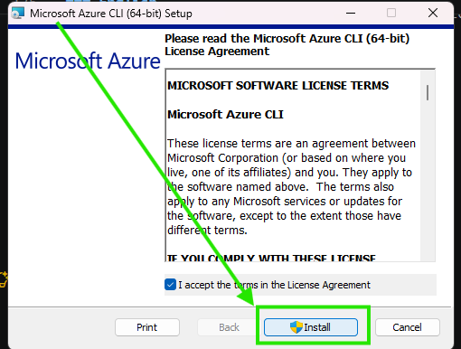
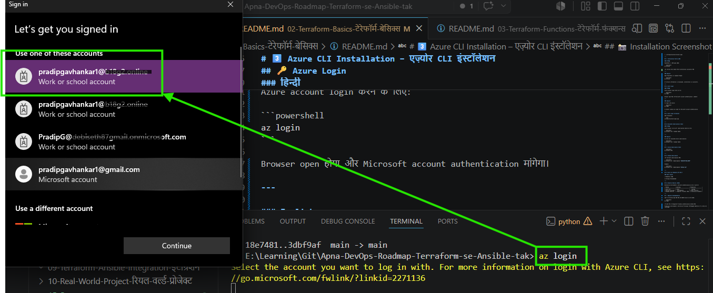
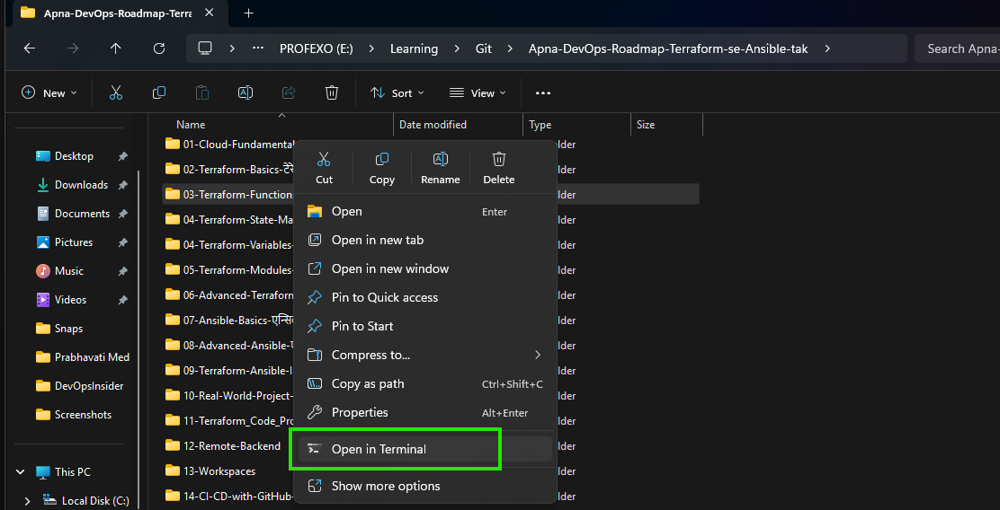
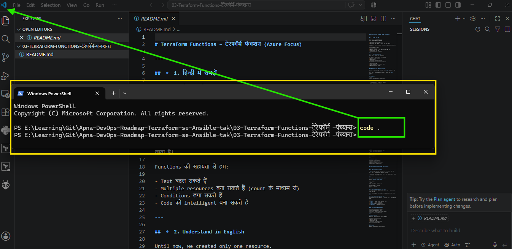

# Terraform Basics – टेरेफॉर्म बेसिक्स (Azure Focus)

## 🛠 Terraform Prerequisites – शुरू करने से पहले

---

## 🎯 हिन्दी में समझें

Terraform सीखना शुरू करने से पहले कुछ tools install और configure करना जरूरी है।

यदि ये tools सही तरीके से install नहीं होंगे तो Terraform commands काम नहीं करेंगी और Azure resources create नहीं हो पाएंगे।

इस section को complete करने के बाद ही आगे के Terraform examples पर जाएँ।

---

## 🎯 Understand in English

Before starting Terraform, you must install and configure a few required tools.

Without these tools, Terraform cannot communicate with Azure or deploy infrastructure.

Complete this setup once and your learning environment will be ready.

---

# 1️⃣ Terraform Installation

## हिन्दी

Terraform मुख्य Infrastructure as Code (IaC) tool है।

इसे HashiCorp की official website से download करें और install करें।

## English

Terraform is the core Infrastructure as Code (IaC) tool developed by HashiCorp.

Download and install it from the official HashiCorp website.

---

### 📸 Terraform Official Download Page

#### हिन्दी

नीचे दिए गए चित्र में Terraform की आधिकारिक HashiCorp Download Page दिखाई गई है।

यहाँ से आप:

- Windows
- Linux
- macOS

के लिए Terraform download कर सकते हैं।

हम इस roadmap में मुख्य रूप से Windows installation का उपयोग करेंगे।

#### English

The image below shows the official HashiCorp Terraform Download Page.

From this page you can download Terraform for:

- Windows
- Linux
- macOS

For this roadmap, we will primarily use Windows installation.
```
https://developer.hashicorp.com/terraform/install
```


---

# 2️⃣ PATH Configuration

## हिन्दी

Terraform install करने के बाद उसका path Windows Environment Variables में add करना जरूरी है।

तभी Terraform command किसी भी terminal या VS Code से run होगी।

## English

After installing Terraform, add its executable path to the Windows PATH environment variable.

This allows Terraform commands to run from any terminal.


### Verify Installation

```bash or Powershell
terraform --version
```

Expected Output:

```bash
Terraform v1.x.x
```

---
# 3️⃣ Azure CLI Installation – एज़्योर CLI इंस्टॉलेशन

---

## 🧠 Azure CLI क्या है?

Azure CLI Microsoft का official command-line tool है जिसका उपयोग Azure resources को manage करने, authentication करने और automation tasks execute करने के लिए किया जाता है।

Terraform Azure provider अक्सर Azure CLI credentials का उपयोग करके Azure subscription से connect करता है।

---

## 🧠 What is Azure CLI?

Azure CLI is Microsoft's official command-line tool used for Azure resource management, authentication, and automation.

Terraform commonly uses Azure CLI credentials to authenticate and connect with Azure subscriptions.

---

## ❓ Azure CLI क्यों जरूरी है?

Terraform को Azure से बात करने के लिए authentication की आवश्यकता होती है।

Learning और Lab environments में Azure CLI सबसे आसान authentication method माना जाता है।

Azure CLI की सहायता से:

* Azure Login कर सकते हैं
* Subscription manage कर सकते हैं
* Resources verify कर सकते हैं
* Terraform authentication कर सकते हैं

---

## ❓ Why is Azure CLI Important?

Terraform requires authentication before creating or managing Azure resources.

Azure CLI is the easiest authentication method for beginners and learning environments.

It helps you:

* Login to Azure
* Manage subscriptions
* Verify resources
* Authenticate Terraform

---

## 🌐 Official Download

Microsoft Official Download Page:

https://learn.microsoft.com/en-us/cli/azure/install-azure-cli-windows

---

## 🪟 Windows Installation Steps

### हिन्दी

1. Microsoft Azure CLI official website खोलें
2. Windows Installer (.msi) download करें
3. Installer run करें
4. Next → Next → Install करें
5. Installation complete होने दें

---

### English

1. Open the Microsoft Azure CLI official website
2. Download the Windows Installer (.msi)
3. Run the installer
4. Click Next → Next → Install
5. Complete the installation

---

## 📸 Installation Screenshot

---

## 🔍 Installation Verify करें

### हिन्दी

PowerShell या CMD open करें:

```powershell
az version
```

यदि version दिखाई देता है तो installation successful है।

---

### English

Open PowerShell or Command Prompt:

```powershell
az version
```

If version information is displayed, installation is successful.

---

## 🔑 Azure Login

### हिन्दी

Azure account login करने के लिए:

```powershell
az login
```

Browser open होगा और Microsoft account authentication मांगेगा।

---

### English

## To login into Azure: Method 1

```powershell
az login
```

A browser window will open for Microsoft account authentication.

---

## 📸 Azure Login Screenshot


---

## To login into Azure: Method 2

# 🔐 Azure Login Using Device Code (Recommended for VS Code Users)

---

## 🧠 हिन्दी

कई बार `az login` command चलाने पर:

* Browser बार-बार खुलता रहता है
* Infinite login loop आता है
* MFA issue आता है
* Corporate laptop restrictions होती हैं
* VS Code authentication fail हो जाता है

ऐसी स्थिति में **Device Code Login Method** सबसे reliable तरीका माना जाता है।

---

## 🧠 English

Sometimes the standard Azure login method may fail because of:

* Infinite browser login loops
* MFA issues
* Corporate security restrictions
* Browser authentication failures
* VS Code authentication problems

In such cases, the **Device Code Login Method** is the most reliable approach.

---

## 🚀 Login Command

PowerShell या VS Code Terminal में command चलाएँ:

```powershell
az login --use-device-code
```

---

## 📋 Expected Output

Command चलाने के बाद आपको कुछ ऐसा दिखाई देगा:

```text
To sign in, use a web browser to open the page:

https://microsoft.com/devicelogin

and enter the code:

ABCD-EFGH
```

---

## 🔹 Step 1

Browser में यह URL खोलें:

```text
https://microsoft.com/devicelogin
```

---

## 🔹 Step 2

Terminal में दिखाई देने वाला code enter करें।

Example:

```text
ABCD-EFGH
```

---

## 🔹 Step 3

Microsoft Account से login करें।

---

## 🔹 Step 4

Authentication complete होने के बाद terminal automatically login success दिखाएगा।

Expected Output:

```json
[
  {
    "cloudName": "AzureCloud",
    "tenantId": "xxxxxxxx",
    "name": "DevOps-Lab",
    "state": "Enabled"
  }
]
```

---

## ✅ Verify Login

Current active subscription check करें:

```powershell
az account show
```

---

## 📋 View All Available Subscriptions

```powershell
az account list --output table
```

---

## 🎯 Set Active Subscription

अगर multiple subscriptions हैं:

```powershell
az account set --subscription "SUBSCRIPTION_NAME"
```

Example:

```powershell
az account set --subscription "DevOps-Lab"
```

---

## 🔍 Verify Active Subscription

```powershell
az account show --output table
```

---

## 🏢 Real Industry Usage

Device Code Login commonly used in:

* Corporate laptops
* Jump servers
* Bastion hosts
* Remote Linux servers
* VS Code Remote Development
* Restricted browser environments

---

## ✔ Good Practice

* Login verify using `az account show`
* Check active subscription before Terraform Apply
* Use dedicated learning subscription
* Logout when lab work is completed

---

## 🚪 Logout

```powershell
az logout
```

---

## ❌ Bad Practice

* Running Terraform without verifying subscription
* Using production subscription accidentally
* Assuming login is successful without checking
* Ignoring tenant information

---

## 😄 DevOps Reality

Browser Login:

```text
Redirecting...
Redirecting...
Redirecting...
Redirecting...
```

DevOps Engineer:

```text
Bas bhai... ab aur nahi 😭
```

Device Code Login:

```powershell
az login --use-device-code
```

Microsoft:

```text
Code daalo aur kaam pe lago 😎
```

---

## 🧠 What You Learned

✔ Device Code Login kya hai
✔ Infinite browser loop ka solution
✔ Azure authentication without browser redirect
✔ Subscription verification
✔ Active subscription selection
✔ Logout process
✔ Industry best practice for restricted environments

---


---

## 📋 Available Subscriptions Check

### हिन्दी

Azure account में उपलब्ध subscriptions देखने के लिए:

```powershell
az account list --output table
```

---

### English

To list all available Azure subscriptions:

```powershell
az account list --output table
```

---

## 🎯 Active Subscription Check

```powershell
az account show
```

---

## 🔄 Change Subscription

यदि multiple subscriptions हैं:

```powershell
az account set --subscription "SUBSCRIPTION_NAME"
```

Example:

```powershell
az account set --subscription "DevOps-Lab"
```

---

## 🤔 Azure CLI Mandatory है क्या?

### Short Answer

❌ Mandatory नहीं

✅ Strongly Recommended

---

## 🏢 Industry Reality (2026)

Enterprise environments में Azure authentication के लिए आमतौर पर:

| Method            | Learning                 | Production            |
| ----------------- | ------------------------ | --------------------- |
| Azure CLI         | ✅ Best                   | ⚠ Limited             |
| Service Principal | ⚠ Intermediate           | ✅ Best Practice       |
| Managed Identity  | ❌ Beginner Friendly नहीं | ✅ Enterprise Standard |

---

## 🚀 Beginner Recommendation

अगर आप Terraform सीख रहे हैं तो शुरुआत Azure CLI से करें:

```powershell
az login
```

यह सबसे आसान और beginner-friendly authentication method है।

Production environments में Service Principal और Managed Identity अधिक उपयोग किए जाते हैं।

---

## ✔ Good Practice

* Official Microsoft website से Azure CLI install करें
* Installation के बाद `az version` verify करें
* Terraform apply से पहले active subscription check करें
* Learning और Production subscriptions अलग रखें
* Multiple subscriptions होने पर सही subscription select करें

---

## ❌ Bad Practice

* Azure login verify किए बिना Terraform run करना
* Production subscription पर testing करना
* Old Azure CLI versions use करना
* Wrong subscription में resources create करना

---

## 😄 DevOps Reality

Terraform:

"Resource bana doon?"

Azure:

"Pehle bata kaun ho? 😎"

Terraform:

"Authentication Failed"

DevOps Engineer:

"Arey yaar... `az login` karna bhool gaya 😅"

---

## 🧠 What You Learned

✔ Azure CLI क्या है
✔ Azure CLI install कैसे करें
✔ Installation verify कैसे करें
✔ Azure login कैसे करें
✔ Subscription manage कैसे करें
✔ Azure CLI vs Service Principal difference
✔ Production best practices

---

## az cli can create resources on cloud, but standard recomendation is to use VS code due to extra code as well as Extenstions ,AI integration as well as easy interface and other cloud friendly features. It is bascally combination of folder structure=> for easy switch called EXPLORER, Command Window=> for command run call TERMINAL open short key CTRL+` and file or code editor window. alot benifits will discuss in next phase.


# 4️⃣ Visual Studio Code (VS Code) Setup – विज़ुअल स्टूडियो कोड सेटअप

---

## 🧠 Visual Studio Code क्या है?

Visual Studio Code (VS Code) Microsoft द्वारा विकसित एक lightweight, powerful और सबसे लोकप्रिय Source Code Editor है।

Terraform, Ansible, Python, Docker, Kubernetes, Git तथा अन्य DevOps tools के साथ काम करने के लिए VS Code industry standard editor माना जाता है।

---

## 🧠 What is Visual Studio Code?

Visual Studio Code (VS Code) is a lightweight and powerful source code editor developed by Microsoft.

It is the industry-standard editor for working with Terraform, Ansible, Python, Docker, Kubernetes, Git, and other DevOps tools.

---

## ❓ VS Code क्यों उपयोग करें?

VS Code beginners से लेकर experienced DevOps Engineers तक सभी के लिए उपयुक्त editor है।

इसके प्रमुख फायदे:

- Lightweight और Fast
- Free & Open Source
- IntelliSense (Code Suggestions)
- Built-in Terminal
- Git Integration
- Extensions Support
- Debugging Support
- Multi-language Support

---

## ❓ Why Use VS Code?

VS Code provides everything needed for modern Infrastructure as Code (IaC) development.

It offers:

- Fast performance
- Built-in terminal
- Git integration
- Rich extension ecosystem
- Excellent Terraform support
- Cross-platform compatibility

---

# 🌐 Official Download

Official Website:

```text
https://code.visualstudio.com/
```

---

# 🪟 Installation Steps (Windows)

## हिन्दी

1. Official VS Code website खोलें।
2. Windows Installer डाउनलोड करें।
3. Installer run करें।
4. Default settings के साथ Install करें।
5. Installation complete होने दें।

---

## English

1. Open the official VS Code website.
2. Download the Windows installer.
3. Run the installer.
4. Keep the default settings.
5. Complete the installation.

---

## 📸 Screenshot Suggestion

Add Screenshot:

```text
15-Snaps/VSCode-Install.png
```

---

# 🚀 Verify Installation

PowerShell या Command Prompt में command चलाएँ:

```powershell
code --version
```

यदि version दिखाई देता है, तो VS Code successfully install हो चुका है।

Example Output:

```text
1.108.0
x64
```

> **Note:** यदि `code` command काम नहीं करती, तो VS Code Command Line PATH enable करना होगा (नीचे देखें)।

---

# 📂 पहला Terraform Project VS Code में कैसे खोलें?

## हिन्दी

1. सबसे पहले अपना project folder बनाइए।

Example:

```text
E:\Learning\DevOps\Terraform-Labs
```

2. उस folder पर **Right Click** करें।

3. **Open in Terminal** चुनें।

4. Terminal खुलने के बाद नीचे दिया गया command चलाएँ।

```powershell
code .
```

`.` (dot) का अर्थ है **Current Folder**।

यह command उसी folder को सीधे VS Code में खोल देती है।

---

## English

1. Create your project folder.

Example:

```text
E:\Learning\DevOps\Terraform-Labs
```

2. Right-click the folder.

3. Select **Open in Terminal**.

4. Run the following command:

```powershell
code .
```

The `.` (dot) represents the current working directory.

VS Code will open directly in the selected folder.

---


## 📸 Open-With-Terminal Screenshot

---

## 📸 VSCode-Code-Dot Screenshot

---
---

# 🛠 What Does `code .` Mean?

```powershell
code .
```

| Command | Meaning |
|----------|----------|
| `code` | Opens Visual Studio Code |
| `.` | Current Folder |

Example:

Current Folder

```text
E:\Learning\DevOps\Terraform-Labs
```

Running:

```powershell
code .
```

Will open:

```text
Terraform-Labs
```

inside VS Code.

---

# ⚠ If `code` Command is Not Working

If you receive:

```text
'code' is not recognized as an internal or external command...
```

It means the VS Code command has not been added to the system PATH.

### Solution

Open VS Code.

Press:

```text
Ctrl + Shift + P
```

Search:

```text
Shell Command: Install 'code' command in PATH
```

Restart PowerShell or CMD and run:

```powershell
code --version
```

---

# 📦 Recommended Folder Structure

```text
Terraform-Labs/
│
├── provider.tf
├── main.tf
├── variables.tf
├── outputs.tf
├── terraform.tfvars
└── README.md
```

---

# ✔ Good Practice

- Create one project per folder.
- Open the project using `code .`
- Keep Terraform files organized.
- Use the integrated terminal instead of multiple CMD windows.
- Store all projects in a dedicated Learning directory.

---

# ❌ Bad Practice

- Creating Terraform files on Desktop.
- Mixing multiple projects in one folder.
- Renaming Terraform files randomly.
- Editing `.terraform` folder manually.
- Ignoring project folder structure.

---

# 😄 DevOps Reality

Developer:

```text
Desktop par hi sab bana deta hoon 😎
```

Senior DevOps Engineer:

```text
Aur phir Desktop par hi sab kho bhi deta hai 😅
```

Professional DevOps Engineer:

```text
Har project ka alag folder...
GitHub backup...
Aur VS Code me "code ." 😎🚀
```

---

# 🧠 What You Learned

✔ What is VS Code

✔ Why VS Code is used in DevOps

✔ Install VS Code

✔ Verify installation

✔ Create a project folder

✔ Open folder using `code .`

✔ Understand the `code .` command

✔ Best practices for Terraform development

---

# 5️⃣ Recommended VS Code Extensions

## HashiCorp Terraform Extension

Purpose:

* Syntax Highlighting
* Auto Completion
* Formatting
* Validation
* Terraform Language Support

---

## Azure Tools Extension

Purpose:

* Azure Account Integration
* Resource Visibility
* Azure Management Support

---

## GitHub Copilot (Optional)

Purpose:

* Code Suggestions
* Learning Support
* Productivity Improvement

---

# 6️⃣ Git Installation – गिट इंस्टॉलेशन

---

## 🧠 Git क्या है?

Git एक Version Control System (VCS) है जो source code changes को track करने के लिए उपयोग किया जाता है।

Git की सहायता से हम:

* Code history track कर सकते हैं
* Changes compare कर सकते हैं
* Previous versions restore कर सकते हैं
* Team collaboration कर सकते हैं
* GitHub पर code backup रख सकते हैं

---

## 🧠 What is Git?

Git is a Version Control System (VCS) used to track source code changes over time.

It helps developers:

* Track code history
* Compare changes
* Restore previous versions
* Collaborate with teams
* Store code in GitHub repositories

---

## ❓ DevOps में Git क्यों जरूरी है?

आज के DevOps world में लगभग हर tool Git के साथ integrate होता है।

Examples:

* Terraform
* Ansible
* Azure DevOps
* GitHub Actions
* Jenkins
* Kubernetes Manifests

Without Git, modern DevOps workflow अधूरा माना जाता है।

---

## ❓ Why is Git Important?

Git is the foundation of modern DevOps practices.

Almost every DevOps tool integrates with Git.

Without Git, Infrastructure as Code and CI/CD workflows become difficult to manage.

---

## 🌐 Official Download

Official Git Website:

```text
https://git-scm.com/downloads
```

---

## 🪟 Windows Installation Steps

### हिन्दी

1. Git Official Website खोलें
2. Windows Download पर क्लिक करें
3. Installer (.exe) download करें
4. Installer run करें
5. Default settings के साथ Next → Next → Install करें
6. Installation complete होने दें

---

### English

1. Open the official Git website
2. Click Windows Download
3. Download the installer (.exe)
4. Run the installer
5. Keep default settings and click Next → Next → Install
6. Complete the installation

---

## 📸 Installation Screenshot

Add Screenshot:

```text
15-Snaps/Git-Install.png
```

---

## 🔍 Verify Installation

### हिन्दी

PowerShell या CMD open करें:

```powershell
git --version
```

Expected Output:

```text
git version 2.xx.x.windows.x
```

यदि version दिखाई देता है तो installation successful है।

---

### English

Open PowerShell or Command Prompt:

```powershell
git --version
```

If a version number appears, Git has been installed successfully.

---

## 👤 Configure Git Username

### हिन्दी

Git commits पर अपना नाम configure करें:

```powershell
git config --global user.name "Pradip Gavhankar"
```

---

### English

Configure your Git username:

```powershell
git config --global user.name "Pradip Gavhankar"
```

---

## 📧 Configure Git Email

### हिन्दी

Git commits के लिए email configure करें:

```powershell
git config --global user.email "your-email@example.com"
```

---

### English

Configure your Git email:

```powershell
git config --global user.email "your-email@example.com"
```

---

## 🔍 Verify Git Configuration

```powershell
git config --global --list
```

Expected Output:

```text
user.name=Pradip Gavhankar
user.email=your-email@example.com
```

---

## 🚀 First Git Repository Check

Current folder status check करें:

```powershell
git status
```

---

## 📦 GitHub Workflow (Most Common Commands)

Initialize repository:

```powershell
git init
```

Add files:

```powershell
git add .
```

Commit changes:

```powershell
git commit -m "Initial Commit"
```

Push to GitHub:

```powershell
git push
```

---

## ✔ Good Practice

* Use meaningful commit messages
* Commit small logical changes
* Push code regularly to GitHub
* Configure username and email correctly
* Use Git for all Terraform and Ansible projects

---

## ❌ Bad Practice

* Using random commit messages like "test"
* Making huge commits with unrelated changes
* Forgetting to push code to GitHub
* Storing passwords in repositories
* Skipping Git configuration

---

## 😄 DevOps Reality

Developer:

```text
Mera code delete ho gaya 😭
```

Git:

```text
Commit kiya tha kya? 😎
```

Developer:

```text
Nahi...
```

Git:

```text
Toh phir bhagwan bharose 😅
```

---

## 🧠 What You Learned

✔ Git क्या है
✔ Git install कैसे करें
✔ Git verify कैसे करें
✔ Username और Email configure कैसे करें
✔ GitHub workflow basics
✔ Common Git commands
✔ DevOps best practices

---


# 7️⃣ Verify Your Lab Environment

Run the following commands:

```bash
terraform version
az version
git --version
az login
```

यदि सभी commands successfully execute हो जाएँ तो आपका Terraform learning environment तैयार है।

If all commands execute successfully, your Terraform lab environment is ready.

---

# ✅ Good Practice

✔ Latest stable Terraform version use करें

✔ Azure CLI updated रखें

✔ HashiCorp Terraform extension install करें

✔ Git version control use करें

✔ Separate Azure learning subscription use करें

✔ Commands run करने से पहले authentication verify करें

---

# ❌ Bad Practice

❌ Terraform install करके PATH configure न करना

❌ Azure login verify किए बिना apply run करना

❌ Production subscription पर learning करना

❌ VS Code extensions skip करना

❌ Git version control use न करना

---

# 😄 DevOps Reality

Terraform install कर लिया...

PATH configure नहीं किया...

फिर 2 घंटे Google पर search किया:

> "terraform is not recognized as an internal or external command"

Welcome to DevOps 😅


Terraform modern DevOps world में Azure infrastructure automation का एक powerful Infrastructure as Code (IaC) tool है।

Terraform is a powerful Infrastructure as Code (IaC) tool used to automate Azure infrastructure in modern DevOps environments.

---

## 🧠 Terraform क्या है?

Terraform एक open-source Infrastructure as Code tool है जो हमें Azure cloud infrastructure को code के माध्यम से define, provision और manage करने की सुविधा देता है।

Terraform is an open-source Infrastructure as Code (IaC) tool that allows us to define, provision, and manage Azure cloud infrastructure using code.

मतलब Azure Resource Group, Virtual Machine, VNet — सब कुछ code से control कर सकते हैं।

---

## ❓ Azure में Terraform क्यों जरूरी है?

Azure Portal से manually resources create करना possible है…

लेकिन production environment में यह scalable नहीं है।

अगर 20 VMs manually बनाओगे तो mistakes guaranteed हैं 😅

Terraform Azure infrastructure को:

- Repeatable बनाता है  
- Version controlled बनाता है  
- Automated बनाता है  
- Multi-environment ready बनाता है  

---

# 🧱 Terraform Syntax & Block Structure

Terraform configuration **Blocks** और **Arguments** से मिलकर बनती है।

---

## 🔹 Block and Argument Structure (Basic Syntax)

```hcl
block_type "label1" "label2" {
  argument_name = value
}
```

Blocks infrastructure components define करते हैं।

---

## 🔹 Types of Blocks

### 1️⃣ Single Name Block

Used once per configuration file.

```hcl
terraform {
  required_version = ">= 1.0.0"
}
```

Purpose:
- Defines Terraform settings
- Specifies version constraints

---

### 2️⃣ Block with One Label

```hcl
provider "azurerm" {
  features {}
}
```

Explanation:
- `provider` → block type  
- `"azurerm"` → label  

Used to configure cloud providers.

---

### 3️⃣ Block with Two Labels

```hcl
resource "azurerm_resource_group" "rg" {
  name     = "rg-demo"
  location = "Central India"
}
```

Explanation:
- `resource` → block type  
- `"azurerm_resource_group"` → resource type  
- `"rg"` → user-defined name  

This is most commonly used block in Terraform.

---
## 🔹 Arguments (Terraform में Arguments क्या होते हैं?)

---

# 🟢 पहले आसान हिन्दी में समझ

Terraform में **Arguments वो values होती हैं जो हम block के अंदर देते हैं**,  
ताकि Terraform को पता चले कि resource कैसे बनाना है।

मतलब:

Block = Structure  
Argument = Settings  

जैसे मोबाइल खरीदते समय:

- Brand = Samsung  
- Color = Black  
- Storage = 128GB  

ये सब mobile के arguments हैं 😄

उसी तरह Terraform में:

- Resource का नाम क्या होगा  
- Location कौन सी होगी  
- Size क्या होगा  

ये सब arguments से decide होता है।

---

# 🔵 English Explanation

Arguments define the configuration properties inside a Terraform block.

They tell Terraform:

- What to create  
- How to create  
- Where to create  

Arguments are written inside `{ }` braces.

---

# 🧱 Simple Real Example (Azure Resource Group)

```hcl
resource "azurerm_resource_group" "rg" {

  # Argument 1 → Resource Group name
  name = "rg-demo"

  # Argument 2 → Azure region
  location = "Central India"
}
```

यहाँ:

- `name` → Argument  / Key in this case
- `"rg-demo"` → Value  
- `location` → Argument  / Key in this case
- `"Central India"` → Value  

Terraform इन arguments के आधार पर Azure में resource बनाएगा।

---

# 🧠 Required vs Optional Arguments

कुछ arguments mandatory होते हैं (Required)  
कुछ optional होते हैं।

Example:

```hcl
resource "azurerm_resource_group" "rg" {
  name     = "rg-demo"         # Required
  location = "Central India"   # Required

  tags = {                     # Optional
    environment = "dev"
  }
}
```

अगर required argument नहीं दिया तो Terraform error देगा ❌

### 📌 Author  
**Pradip Gavhankar**  
*DevOps | Cloud | DevSecOps | FinOps Learning Journey*