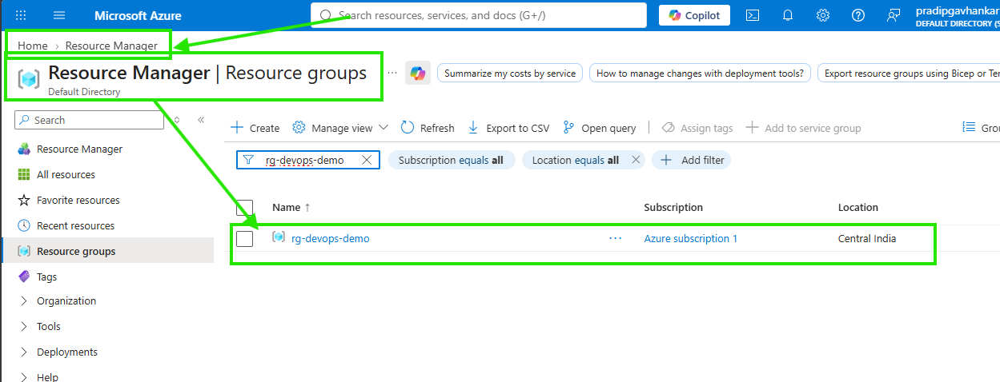
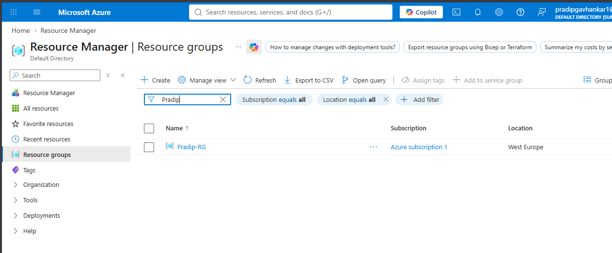

## 🔄 Terraform Workflow (Azure Context)

Terraform Azure के साथ 4 main steps में काम करता है:

### 1️⃣ terraform init
- Initializes project  
- Downloads Azure provider  
-.terraform folder got dependency
- created files LICENCE.txt and terraform-provider-azurerm_version.exe
-file created .terraform.lock.hcl (control version)

### 2️⃣ terraform plan
- Preview दिखाता है क्या + create / ~ modify / - destroy होगा  

### 3️⃣ terraform apply
- Azure subscription में actual resources create करता है  
- implemented Preview दिखाता है क्या + create / ~ modify / - destroy होगा  
-It will create terraform.tfstate file which is memory of complete infra, since this is stored in centralised secure place like ACR in storage account of azure.
### 4️⃣ terraform destroy
- Azure resources delete करता है  

---

## 🗂️ Basic Azure Terraform File Structure

A basic Azure Terraform project contains:

- 1`provider.tf` → Azure provider configuration  
- 4`main.tf` → Resource definitions  (prefer to write after variable.tf, get all block from azure terraform registry)
- 3.`variables.tf` → Input variables  (prefer to write after terraform.tfvars)
- 5`outputs.tf` → Output values  (if output id want to print on CLI then this block used)
- 2.`terraform.tfvars` → Variable values (prefer to write this files code after provider.tf all details fetch from this files, If this code has sensitive inforamtion then not push on github by keeping in .gitignore) 

---

# 🧪 Example: Azure Resource Group Creation (Step-by-Step)
# Terraform_Code_Projects > First Resource Creation > Start
## 🔹 provider.tf

```hcl
terraform {
  required_providers {
    azurerm = {
      source  = "hashicorp/azurerm"
      version = "~> 5.1.0"
    }
  }
}

provider "azurerm" {
  features {}
}
```
---
## 🔹 terraform.tfvars

```hcl
resource_group_name = "rg-devops-demo"
location            = "Central India"
```
---
## 🔹 variables.tf

```hcl
variable "resource_group_name" {
  description = "Azure Resource Group ka naam"
  type        = string
}

variable "location" {
  description = "Azure region"
  type        = string
}
```

---

## 🔹 main.tf

```hcl
resource "azurerm_resource_group" "rg" {
  name     = var.resource_group_name
  location = var.location
}
```
---

## 🔹 outputs.tf

```hcl
output "resource_group_id" {
  value = azurerm_resource_group.rg.id
}
```

---

## 🔹 Terraform Commands

### terraform init 

Expected Output:
```
- Initializes project  
- Downloads Azure provider  
-.terraform folder got dependency
- created files LICENCE.txt and terraform-provider-azurerm_version.exe
-file created .terraform.lock.hcl (control version), if ant to update version CMD-terraform init -upgrade
```


```
Initializing the backend...
Initializing provider plugins...
- Finding hashicorp/azurerm versions matching "4.77.0"...
- Installing hashicorp/azurerm v4.77.0...
- Installed hashicorp/azurerm v4.77.0 (signed by HashiCorp)
Terraform has created a lock file .terraform.lock.hcl to record the provider
selections it made above. Include this file in your version control repository
so that Terraform can guarantee to make the same selections by default when
you run "terraform init" in the future.
```
```diff
+ Terraform has been successfully initialized!

+ You may now begin working with Terraform. Try running "terraform plan" to see
+ any changes that are required for your infrastructure. All Terraform commands
+ should now work.

+ If you ever set or change modules or backend configuration for Terraform,
+ rerun this command to reinitialize your working directory. If you forget, other
+ commands will detect it and remind you to do so if necessary.
```
### +  => New resource will create
### -  => Created Resource will delete
### ~  => Resource Modified

Output Example as under to understand + , - and ~
```
Terraform will perform the following actions:

  # azurerm_resource_group.first_Cart will be updated in-place
  ~ resource "azurerm_resource_group" "first_Cart" {
        id         = "/subscriptions/a2d0788b-89e9-49c6-8c6a-5f152ef8d304/resourceGroups/Pradip-cart"
        name       = "Pradip-cart"
      ~ tags       = {
            "Kuku"   = "koyal"
          - "bhobho" = "puppy" -> null
        }
        # (2 unchanged attributes hidden)
    }

Plan: 0 to add, 1 to change, 0 to destroy.
azurerm_resource_group.first_Cart: Modifying... [id=/subscriptions/a2d0788b-89e9-49c6-8c6a-5f152ef8d304/resourceGroups/Pradip-cart]
azurerm_resource_group.first_Cart: Modifications complete after 8s [id=/subscriptions/a2d0788b-89e9-49c6-8c6a-5f152ef8d304/resourceGroups/Pradip-cart]

Apply complete! Resources: 0 added, 1 changed, 0 destroyed.
```

### terraform plan

Expected Output:

```
Terraform used the selected providers to generate the following execution plan. Resource actions are indicated with the following symbols:
  + create

Terraform will perform the following actions:

  # azurerm_resource_group.rg will be created
  + resource "azurerm_resource_group" "rg" {
      + id       = (known after apply) #This ID will created after terraform apply -auto-approve
      + location = "centralindia"
      + name     = "rg-devops-demo"
    }

Plan: 1 to add, 0 to change, 0 to destroy.
```

### terraform apply

Expected Output:

```
Terraform used the selected providers to generate the following execution plan. Resource actions are indicated with the following symbols:
  + create

Terraform will perform the following actions:

  # azurerm_resource_group.rg will be created
  + resource "azurerm_resource_group" "rg" {
      + id       = (known after apply)
      + location = "centralindia"
      + name     = "rg-devops-demo"
    }

Plan: 1 to add, 0 to change, 0 to destroy.

Changes to Outputs:
  + resource_group_id = (known after apply)

Do you want to perform these actions?
  Terraform will perform the actions described above.
  Only 'yes' will be accepted to approve.

  Enter a value: yes

azurerm_resource_group.rg: Creating...
azurerm_resource_group.rg: Still creating... [00m10s elapsed]
azurerm_resource_group.rg: Still creating... [00m20s elapsed]
azurerm_resource_group.rg: Still creating... [00m30s elapsed]
azurerm_resource_group.rg: Creation complete after 32s [id=/subscriptions/cf4adfd0-252d-4813-b002-f6f2095a23a8/resourceGroups/rg-devops-demo]
```
```diff
+Apply complete! Resources: 1 added, 0 changed, 0 destroyed.

+Outputs:

resource_group_id = "/subscriptions/cf4adfd0-252d-4813-b002-f6f2095a23a8/resourceGroups/rg-devops-demo"
```

### OR terraform apply -auto-approve


"terraform apply" #shows plan, then we have to put "yes". My recommendation go with
"terraform apply -auto-approve" directly

```
Terraform used the selected providers to generate the following execution plan. Resource actions are indicated with the following symbols:
  + create

Terraform will perform the following actions:

  # azurerm_resource_group.rg will be created
  + resource "azurerm_resource_group" "rg" {
      + id       = (known after apply)
      + location = "centralindia"
      + name     = "rg-devops-demo"
    }

Plan: 1 to add, 0 to change, 0 to destroy.

Changes to Outputs:
  + resource_group_id = (known after apply)
azurerm_resource_group.rg: Creating...
azurerm_resource_group.rg: Still creating... [00m10s elapsed]
azurerm_resource_group.rg: Still creating... [00m20s elapsed]
azurerm_resource_group.rg: Creation complete after 28s [id=/subscriptions/cf4adfd0-252d-4813-b002-f6f2095a23a8/resourceGroups/rg-devops-demo]
```
```diff
+Apply complete! Resources: 1 added, 0 changed, 0 destroyed.

+Outputs:

resource_group_id = "/subscriptions/cf4adfd0-252d-4813-b002-f6f2095a23a8/resourceGroups/rg-devops-demo"
```
### Azure Portal Output
### 📸 First Azure Resource created



## terraform destroy OR terraform destroy -auto-approve 
### ( ⚠️ Caution❌DONT USE in Production, this is for knowledge in learning ensure to delete created Azure resource to avoid billing)
Expected Output:

```
Terraform used the selected providers to generate the following execution plan. Resource actions are indicated with the following symbols:
  - destroy

Terraform will perform the following actions:

  # azurerm_resource_group.rg will be destroyed
  - resource "azurerm_resource_group" "rg" {
      - id         = "/subscriptions/cf4adfd0-252d-4813-b002-f6f2095a23a8/resourceGroups/rg-devops-demo" -> null
      - location   = "centralindia" -> null
      - name       = "rg-devops-demo" -> null
      - tags       = {} -> null
        # (1 unchanged attribute hidden)
    }

Plan: 0 to add, 0 to change, 1 to destroy.

Changes to Outputs:
  - resource_group_id = "/subscriptions/cf4adfd0-252d-4813-b002-f6f2095a23a8/resourceGroups/rg-devops-demo" -> null
azurerm_resource_group.rg: Destroying... [id=/subscriptions/cf4adfd0-252d-4813-b002-f6f2095a23a8/resourceGroups/rg-devops-demo]
azurerm_resource_group.rg: Still destroying... [id=/subscriptions/cf4adfd0-252d-4813-b002-...095a23a8/resourceGroups/rg-devops-demo, 00m10s elapsed]
azurerm_resource_group.rg: Still destroying... [id=/subscriptions/cf4adfd0-252d-4813-b002-...095a23a8/resourceGroups/rg-devops-demo, 00m20s elapsed]
azurerm_resource_group.rg: Destruction complete after 25s
```
```diff
+Destroy complete! Resources: 1 destroyed.
```
# Terraform_Code_Projects > First Resource Creation > End

### हिंदी

भाई, अब Google से Terraform Azure Registry पर जाकर azurerm_provider का Block ले आ और Terraform के Commands चला दे।
बस, हो गया! 😎

### English

Bro, now go to the Terraform Azure Registry through Google, get the azurerm_provider Block, and run the Terraform commands.

That's it, we're done! 😎

---

# 📦 Variable Data Types in Terraform

---

## 🧠 Variable Data Type क्या होता है?

Terraform में Variable Data Type यह निर्धारित करता है कि variable किस प्रकार का data accept करेगा।

Data type define करने से:

- Input validation मिलती है
- गलत values रोकी जा सकती हैं
- Code अधिक reliable बनता है
- Team collaboration आसान होती है

---

## 🧠 What is a Variable Data Type?

A Variable Data Type defines what kind of data a variable can accept.

Benefits:

- Input validation
- Better code quality
- Reduced configuration mistakes
- Improved maintainability


# 🧩 Terraform Variable Data Types – Complete Practical Guide

Terraform में Variables infrastructure code को **dynamic, reusable और production-ready** बनाने के लिए उपयोग होते हैं।

एक ही Terraform code को अलग-अलग environments जैसे:

- DEV
- QA
- TEST
- PROD
- PRE-PROD

में अलग-अलग values के साथ reuse किया जा सकता है।

In Terraform, variables are used to make infrastructure code dynamic, reusable, and production-ready.
The same Terraform code can be reused across different environments, such as:
- DEV
- QA
- TEST
- PROD
- PRE-PROD
with different values
---

# 🗺️ Terraform Variable Data Types

Terraform में commonly used data types:

```text
Terraform Variables
│
├── Primitive Types
│   ├── String
│   ├── Number
│   └── Bool
│
├── Collection Types
│   ├── List
│   ├── Set
│   └── Map
│
├── Structural Types
│   ├── Object
│   └── Tuple
│
└── Dynamic Type
    └── Any
```

# Primitive Types

## 1️⃣ String

## 🟢 हिन्दी

string का उपयोग text value store करने के लिए किया जाता है।

Server names, Resource Group names, Locations आदि में सबसे अधिक उपयोग होता है।
Examples:

Resource Group Name
Location
Environment Name
VM Name
Storage Account Name

## 🔵 English

A string stores a sequence of characters/text.

Commonly used for names, locations, environments, and tags.
Examples:

Resource Group Name
Location
Environment Name
VM Name
Storage Account Name


## Variable Definition and files code to understand better
# Terraform_Code_Projects > Second Variables Resource creation > Start
### terraform.tfvars

```hcl
location = "West Europe"
```
### variables.tf

```hcl
variable "location" {
  description = "Azure region where resources will be created"
  type        = string
}
```

### main.tf

```hcl
resource "azurerm_resource_group" "example" {

  name     = "Pradip-RG"
  location = var.location #Variable calling system used

}
```
# If no change in provider block then there is no need to rerun "Terraform init"
### 🚀 Expected Output > Terraform Plan
```
# azurerm_resource_group.example will be created

+ resource "azurerm_resource_group" "example" {
    + id       = (known after apply)
    + location = "westeurope"
    + name     = "Pradip-RG"
  }

Plan: 1 to add, 0 to change, 0 to destroy.
```
### 🚀 Expected Output > Terraform apply
```

Terraform used the selected providers to generate the following execution plan. Resource actions are indicated with the following symbols:
  + create

Terraform will perform the following actions:

  # azurerm_resource_group.example will be created
  + resource "azurerm_resource_group" "example" {
      + id       = (known after apply)
      + location = "westeurope"
      + name     = "Pradip-RG"
    }

Plan: 1 to add, 0 to change, 0 to destroy.

Do you want to perform these actions?
  Terraform will perform the actions described above.
  Only 'yes' will be accepted to approve.

  Enter a value: yes

azurerm_resource_group.example: Creating...
azurerm_resource_group.example: Still creating... [00m10s elapsed]
azurerm_resource_group.example: Still creating... [00m20s elapsed]
azurerm_resource_group.example: Still creating... [00m30s elapsed]
azurerm_resource_group.example: Creation complete after 33s [id=/subscriptions/cf4adfd0-252d-4813-b002-f6f2095a23a8/resourceGroups/Pradip-RG]

Apply complete! Resources: 1 added, 0 changed, 0 destroyed.
```
### Azure Portal Output
### 📸 Second Azure Resource created



## terraform destroy OR terraform destroy -auto-approve 
### ( ⚠️ Caution❌DONT USE in Production, this is for knowledge in learning ensure to delete created Azure resource to avoid billing)

# Terraform_Code_Projects > Second Variables Resource creation > End
---

# 2️⃣ Number

## 🟢 हिन्दी

number numeric value के लिए उपयोग होता है। Terraform में integer और floating-point=>143.12 दोनों numeric values हो सकती हैं।

## 🔵 English

A number represents numeric values. Terraform intergers and floting-points=>143.12 are numeric values.

Examples:

VM Count
Disk Size
Port Number
Instance Count
CPU Count

### Example

```hcl
variable "vm_count" {
  type = number
}
```
vm_count = 3 # You can put any numbers as per resources need.

# Terraform_Code_Projects > Third Variables Resource creation > Start
### 🧱 terraform.tfvars
```
enable_public_ip = true
```
### 🧱 variables.tf
```
variable "vm_count" {
  description = "Number of virtual machines"
  type        = number
}
```
### main.tf
```
resource "azurerm_resource_group" "example" {

  count = var.vm_count

  name     = "Pradip-RG-${count.index + 1}"
  location = "West Europe"

}
```
### 🚀 Expected Output for count "3"
```var.vm_count
  Number of Resource Group

  Enter a value: 3

azurerm_resource_group.example[1]: Refreshing state... [id=/subscriptions/cf4adfd0-252d-4813-b002-f6f2095a23a8/resourceGroups/Pradip-RG-2]
azurerm_resource_group.example[0]: Refreshing state... [id=/subscriptions/cf4adfd0-252d-4813-b002-f6f2095a23a8/resourceGroups/Pradip-RG-1]
azurerm_resource_group.example[2]: Refreshing state... [id=/subscriptions/cf4adfd0-252d-4813-b002-f6f2095a23a8/resourceGroups/Pradip-RG-3]

Terraform used the selected providers to generate the following execution plan. Resource actions are indicated with the following symbols:
  + create

Terraform will perform the following actions:

  # azurerm_resource_group.example[0] will be created
  + resource "azurerm_resource_group" "example" {
      + id       = (known after apply)
      + location = "westeurope"
      + name     = "Pradip-RG-1"
    }

  # azurerm_resource_group.example[1] will be created
  + resource "azurerm_resource_group" "example" {
      + id       = (known after apply)
      + location = "westeurope"
      + name     = "Pradip-RG-2"
    }

  # azurerm_resource_group.example[2] will be created
  + resource "azurerm_resource_group" "example" {
      + id       = (known after apply)
      + location = "westeurope"
      + name     = "Pradip-RG-3"
    }

Plan: 3 to add, 0 to change, 0 to destroy.
```
# Terraform_Code_Projects > Third Variables Resource creation > End

### Azure Portal Other Related Example

```hcl
disk_size_gb = 128
```

---

# 3️⃣ Boolean (Bool)

## हिन्दी

Boolean केवल दो values स्वीकार करता है:
इसका उपयोग किसी feature को enable या disable करने के लिए किया जाता है।
- true
- false

## English

Boolean accepts only:
It is used to enable and disable features
- true
- false

## Typical production examples:

Enable monitoring
Enable backup
Enable diagnostics
Enable public IP
Enable encryption

# Terraform_Code_Projects > Fourth Variables Resource creation > Start
### 🧱 terraform.tfvars
```
enable_public_ip = true
```

### 🧱 variables.tf
```
variable "enable_public_ip" {
  description = "Whether public IP should be created"
  type        = bool
  default     = false
}
```

### main.tf
```
resource "azurerm_resource_group" "RG" {
  name     = "Pradip-RG"
  location = "Central India"
}

resource "azurerm_public_ip" "example" {
  name                = "${azurerm_resource_group.RG.name}-Public-IP"
  resource_group_name = azurerm_resource_group.RG.name
  location            = azurerm_resource_group.RG.location

  allocation_method = "Static"
  sku               = "Standard"
}
```
### 🚀 Expected Output

### अगर / If
```
enable_public_ip = true
```
### तो / Then RG and IP will create
```
Terraform used the selected providers to generate the following execution plan. Resource actions are indicated with the following symbols:
  + create

Terraform will perform the following actions:

  # azurerm_public_ip.example[0] will be created
  + resource "azurerm_public_ip" "example" {
      + allocation_method       = "Static"
      + ddos_protection_mode    = "VirtualNetworkInherited"
      + fqdn                    = (known after apply)
      + id                      = (known after apply)
      + idle_timeout_in_minutes = 4
      + ip_address              = (known after apply)
      + ip_version              = "IPv4"
      + location                = "centralindia"
      + name                    = "Pradip-RG-Public-IP"
      + resource_group_name     = "Pradip-RG"
      + sku                     = "Standard"
      + sku_tier                = "Regional"
    }

  # azurerm_resource_group.RG will be created
  + resource "azurerm_resource_group" "RG" {
      + id       = (known after apply)
      + location = "centralindia"
      + name     = "Pradip-RG"
    }

Plan: 2 to add, 0 to change, 0 to destroy.
```
### अगर / If
```
enable_public_ip = false 
```
### तो / Then Only 1 RG will create
```
Terraform used the selected providers to generate the following execution plan. Resource actions are indicated with the following symbols:
  + create

Terraform will perform the following actions:

  # azurerm_resource_group.RG will be created
  + resource "azurerm_resource_group" "RG" {
      + id       = (known after apply)
      + location = "centralindia"
      + name     = "Pradip-RG"
    }

Plan: 1 to add, 0 to change, 0 to destroy.

```
# Terraform_Code_Projects > Fourth Variables Resource creation > End

### Example

```hcl
variable "enable_backup" {
  type = bool
}

enable_backup = true
```

### Azure Example

```hcl
enable_https_traffic_only = true
```
## Collection Types
---

# 4️⃣ List

## 🟢 हिन्दी

list ordered collection होती है।

इसमें:

Values का order maintain रहता है
Duplicate values allowed होती हैं
Same data type की values होती हैं

## 🔵 English

A list is an ordered collection of values of the same type.

Example:
```
["frontend", "backend", "database"]
```
# Terraform_Code_Projects > Fifth Variables Resource creation > Start

### 🧱 terraform.tfvars

```
availability_zones = [
  "1",
  "2",
  "3"
]
```

### 🧱 variables.tf

```
variable "availability_zones" {
  description = "Azure availability zones"
  type        = list(string)
}
```

### main.tf
```
resource "azurerm_resource_group" "RG" {
  name     = "Pradip-RG"
  location = "Central India"
}
```
### output.tf
```
output "availability_zones" {
  value = var.availability_zones
}
```
### 🚀 Expected Output

```
Terraform used the selected providers to generate the following execution plan. Resource actions are indicated with the following symbols:
  + create

Terraform will perform the following actions:

  # azurerm_resource_group.RG will be created
  + resource "azurerm_resource_group" "RG" {
      + id       = (known after apply)
      + location = "centralindia"
      + name     = "Pradip-RG"
    }

Plan: 1 to add, 0 to change, 0 to destroy.

Changes to Outputs:
  + availability_zones = [
      + "1",
      + "2",
      + "3",
    ]
```
# Terraform_Code_Projects > Fifth Variables Resource creation > End

### 💡 List Index

List में index 0 से शुरू होता है।

```
output "first_zone" {
  value = var.availability_zones[0]
}
```
### Output
```
first_zone = "1"
```
---

# 5️⃣ Map

## हिन्दी

Map key-value pair format में data store करता है।

Tags management में बहुत उपयोग होता है।

## English

Map stores data as key-value pairs.

Frequently used for tags and metadata.

### Example

```
environment = dev
owner       = pradip
project     = terraform


```hcl
variable "tags" {
  type = map(string)
}
```

```hcl
tags = {
  Environment = "Production"
  Owner       = "DevOps Team"
}
```
# Terraform_Code_Projects > Sixth Variables Resource creation > Start
### 🧱 terraform.tfvars

```
tags = {
  environment = "dev"
  owner       = "Pradip"
  project     = "Terraform"
}
```

### 🧱 variables.tf

```
variable "tags" {
  description = "Common resource tags"
  type        = map(string)
}
```

### main.tf

```
resource "azurerm_resource_group" "example" {

  name     = "Pradip-RG"
  location = "West Europe"

  tags = var.tags
}
```
### 🚀 Expected Output

```

Terraform used the selected providers to generate the following execution plan. Resource actions
are indicated with the following symbols:
  + create

Terraform will perform the following actions:

  # azurerm_resource_group.example will be created
  + resource "azurerm_resource_group" "example" {
      + id       = (known after apply)
      + location = "westeurope"
      + name     = "Pradip-RG"
      + tags     = {
          + "environment" = "dev"
          + "owner"       = "Pradip"
          + "project"     = "Terraform"
        }
    }

Plan: 1 to add, 0 to change, 0 to destroy.
```
# Terraform_Code_Projects > Sixth Variables Resource creation > End
---

# 6️⃣ Object

## 🟢 हिन्दी

object का उपयोग तब किया जाता है जब हमें एक variable के अंदर अलग-अलग properties और उनके specific data types define करने हों।

Object multiple related values को structured format में store करता है।

Production projects में सबसे ज्यादा उपयोग होने वाले advanced data types में से एक है।


## 🔵 English

An object is a structured value where every attribute can have its own data type.
Object stores multiple related values in a structured format.

Widely used in enterprise Terraform projects.

### Example

```
name     → string
location → string
count    → number
enabled  → bool
```

```hcl
variable "vm_config" {

  type = object({

    vm_name = string
    size    = string
    os_type = string
  })
}
```

Value:

```hcl
vm_config = {

  vm_name = "webvm01"
  size    = "Standard_B2s"
  os_type = "Linux"
}
```
# Terraform_Code_Projects > Seventh Variables Resource creation > Start
### 🧱 terraform.tfvars
```
resource_group = {
  name     = "Pradip-RG"
  location = "West Europe"
  enabled  = true
}
```
### 🧱 variables.tf
```
variable "resource_group" {

  description = "Azure Resource Group configuration"

  type = object({
    name     = string
    location = string
    enabled  = bool
  })

}
```

### 🧱 main.tf
```
resource "azurerm_resource_group" "example" {

  count = var.resource_group.enabled ? 1 : 0

  name     = var.resource_group.name
  location = var.resource_group.location

}
```
### 🚀 Expected Output
```
Terraform used the selected providers to generate the following execution plan. Resource actions are indicated with the following symbols:
  + create

Terraform will perform the following actions:

  # azurerm_resource_group.example[0] will be created
  + resource "azurerm_resource_group" "example" {
      + id       = (known after apply)
      + location = "westeurope"
      + name     = "Pradip-RG"
    }

Plan: 1 to add, 0 to change, 0 to destroy.
```

# Terraform_Code_Projects > Seventh Variables Resource creation > End
---

# 7️⃣ Set

## 🟢 हिन्दी

यह Terraform में बहुत powerful और production में बहुत useful structure है।

जब हमें एक ही प्रकार के कई resources को structured तरीके से define करना हो, तब:

```
map(object({...}))
```
का उपयोग किया जा सकता है।

Set list जैसा होता है लेकिन duplicate values allow नहीं करता।

## 🔵 English

A map(object(...)) is extremely useful for creating multiple similar resources from structured configuration.

A Set is similar to a list but removes duplicate values.

### Example
```
RG
│
├── rg1
│   ├── name
│   └── location
│
├── rg2
│   ├── name
│   └── location
│
└── rg3
    ├── name
    └── location
```
```hcl
variable "allowed_ports" {

  type = set(number)
}
```

Value:

```hcl
allowed_ports = [80, 443, 80]
```

Terraform internally:

```hcl
[80, 443]
```
# Terraform_Code_Projects > Eighth Variables Resource creation > Start
### 🧱 terraform.tfvars
```
resource_groups = {
  rg1 = {
    name     = "Pradip-RG"
    location = "West Europe"
  }

  rg2 = {
    name     = "Pradip-RG-India"
    location = "Central India"
  }

  rg3 = {
    name     = "Pradip-RG-US"
    location = "East US"
  }
}
```
### 🧱 variables.tf
```
variable "resource_groups" {

  description = "Map of Azure Resource Groups"

  type = map(object({

    name     = string
    location = string

  }))
}
```

### 🧱 main.tf
```
resource "azurerm_resource_group" "example" {

  for_each = var.resource_groups

  name     = each.value.name
  location = each.value.location

}
```
### 🚀 Expected terraform plan output
```

Terraform used the selected providers to generate the following execution plan. Resource actions
are indicated with the following symbols:
  + create

Terraform will perform the following actions:

  # azurerm_resource_group.example["rg1"] will be created
  + resource "azurerm_resource_group" "example" {
      + id       = (known after apply)
      + location = "westeurope"
      + name     = "Pradip-RG"
    }

  # azurerm_resource_group.example["rg2"] will be created
  + resource "azurerm_resource_group" "example" {
      + id       = (known after apply)
      + location = "centralindia"
      + name     = "Pradip-RG-India"
    }

  # azurerm_resource_group.example["rg3"] will be created
  + resource "azurerm_resource_group" "example" {
      + id       = (known after apply)
      + location = "eastus"
      + name     = "Pradip-RG-US"
    }

Plan: 3 to add, 0 to change, 0 to destroy.
```
# Terraform_Code_Projects > Eighth Variables Resource creation > End
### 🔍 Understanding for_each
```
for_each = var.resource_groups
```
Terraform हर map entry के लिए एक Resource Group बनाएगा।
```
each.key
```
### Example
```
rg1
rg2
rg3
```
और:
```
each.value.name
```
### Example
```
Pradip-RG
Pradip-RG-India
Pradip-RG-US
```


---

# 8️⃣ Tuple

## 🟢 हिन्दी

tuple ordered collection है लेकिन list से अलग है।

Tuple में हर position का data type पहले से define किया जा सकता है।

Tuple fixed position और fixed datatype structure define करता है।

## English

Tuple defines a fixed-position and fixed-type structure.

### Example
```
String
Number
Bool
```

### Example

```hcl
variable "server_info" {

  type = tuple([
    string,
    number,
    bool
  ])
}
```

Value:

```hcl
server_info = [
  "web-server",
  2,
  true
]
```

---

## Industry Reality

Tuple rarely used.

Object is preferred.
# Terraform_Code_Projects > Nineth Variables Resource creation > Start

### 🧱 terraform.tfvars
```
server_configuration = [
  "frontend",
  2,
  true
]
```

### 🧱 variables.tf
```
variable "server_configuration" {

  description = "Server configuration"

  type = tuple([
    string,
    number,
    bool
  ])

}
```

### 🧱 main.tf (Blank)
### 🧱 output.tf
```
output "server_name" {
  value = var.server_configuration[0]
}

output "server_count" {
  value = var.server_configuration[1]
}

output "monitoring_enabled" {
  value = var.server_configuration[2]
}
```
### 🚀 Expected Output
```
                
Changes to Outputs:
  + monitoring_enabled = true
  + server_count       = 2
  + server_name        = "frontend"

You can apply this plan to save these new output values to the Terraform state, without changing
any real infrastructure.
```
# Terraform_Code_Projects > Nineth Variables Resource creation > End

# 9️⃣ SET
### 🟢 हिन्दी

set भी collection है लेकिन यह:

Duplicate values allow नहीं करता
Ordering पर depend नहीं करना चाहिए

### Example
```
toset([
  "dev",
  "qa",
  "prod"
])
```
### 🔵 English

A set is an unordered collection of unique values.
# Terraform_Code_Projects > Tenth Variables Resource creation > Start
### 🧱 terraform.tfvars
```
environments = [
  "dev",
  "qa",
  "prod",
  "dev"
]
```
### 🧱 variables.tf
```
variable "environments" {

  description = "Deployment environments"

  type = set(string)

}
```
### 🧱 main.tf (Blank)
### 🧱 output.tf
```
output "environments" {
  value = var.environments
}
```
### 🚀 Expected Output
dev duplicate होने के बावजूद set में एक ही बार रहेगा।
### Conceptually:
```
Changes to Outputs:
  + environments = [
      + "dev",
      + "prod",
      + "qa",
    ]
```
# Terraform_Code_Projects > Tenth Variables Resource creation > End
### ⚠ Important

Set में ordering guaranteed नहीं होती।

इसलिए ऐसा assume मत करो:
```
var.environments[0]
```
अगर index-based access चाहिए तो list बेहतर choice है।

# 🔟 ANY

## 🟢 हिन्दी

any का अर्थ है कि variable किसी भी Terraform type की value accept कर सकता है।

## 🔵 English

any is a dynamic type constraint. It allows Terraform to accept values of different types.

### Example
```
string
number
bool
list
map
object
```


### Example

```hcl
variable "input_value" {

  type = any
}
```

Valid values:

```hcl
input_value = "hello"
```

or

```hcl
input_value = 100
```

or

```hcl
input_value = true
```
# Terraform_Code_Projects > 11th Variables Resource creation Project Project Project Project Project > Start
### 🧱 variables.tf
```
variable "configuration" {

  description = "Flexible configuration value"

  type = any

}
```
### 🧱 terraform.tfvars(Blank)
### Example 1:
```
configuration = "development"
```
### Output
```
var.configuration
  Flexible configuration value

  Enter a value: "development"


No changes. Your infrastructure matches the configuration.

Terraform has compared your real infrastructure against your configuration and found no differences, so no changes are needed.
```

या:
### Example 2:
```
configuration = {
  environment = "dev"
  owner       = "Pradip"
}
```
### Output
```
No changes. Your infrastructure matches the configuration.
         
Terraform has compared your real infrastructure against your configuration and found no differences, so no changes are needed.
```
या:
### Example 3:
```
configuration = [
  "dev",
  "qa",
  "prod"
]
```
### ⚠ Production Recommendation

any powerful है लेकिन production code में unnecessarily use नहीं करना चाहिए।

जहाँ possible हो वहाँ specific type define करें:
```
type = string
```
या:
```
type = map(string)
```
या:
```
type = object({
  name     = string
  location = string
})
```
इससे Terraform validation बेहतर करता है और configuration ज्यादा predictable रहती है।
---

## Industry Recommendation

Avoid using `any` in production.

Prefer explicit data types.

## 🧠 LIST vs SET vs MAP

| Type   | Order           | Duplicate   | Structure                | Example             |
| ------ | --------------- | ----------- | ------------------------ | ------------------- |
| List   | ✅ Yes           | ✅ Yes       | Same type                | `["dev","qa"]`      |
| Set    | ❌ No            | ❌ No        | Same type                | `["dev","qa"]`      |
| Map    | Key based       | Keys unique | Same value type          | `{env="dev"}`       |
| Object | Attribute based | N/A         | Different types possible | `{name="",count=1}` |
| Tuple  | Position based  | Depends     | Different types possible | `["web",2,true]`    |

## 🧠 LIST vs TUPLE

List
```
type = list(string)
```
All elements must be strings.
```
[
  "dev",
  "qa",
  "prod"
]
```
Tuple
```
type = tuple([
  string,
  number,
  bool
])
```
Different positions can have different types.
```
[
  "frontend",
  2,
  true
]
```
## 🧠 MAP vs OBJECT
Map

Map में सभी values generally same declared type की होती हैं।
```
type = map(string)
```
### Example:
```
{
  environment = "dev"
  owner       = "Pradip"
}
```
Object

Object में अलग-अलग attributes के अलग-अलग data types हो सकते हैं।
```
type = object({
  name     = string
  count    = number
  enabled  = bool
})
```
### Example:
```
{
  name    = "frontend"
  count   = 3
  enabled = true
}
```
## 🚀 REAL AZURE PRODUCTION-STYLE EXAMPLE

एक real-world configuration को structured तरीके से define कर सकते हैं।
### terraform.tfvars
```
resource_groups = {

  frontend = {

    name     = "Pradip-Frontend-RG"
    location = "West Europe"

    tags = {
      environment = "dev"
      application = "frontend"
      owner       = "DevOps"
    }

  }

  backend = {

    name     = "Pradip-Backend-RG"
    location = "West Europe"

    tags = {
      environment = "dev"
      application = "backend"
      owner       = "DevOps"
    }

  }

}
```
### variables.tf
```
variable "resource_groups" {

  description = "Azure Resource Group configuration"

  type = map(object({

    name     = string
    location = string
    tags     = map(string)

  }))

}
```

### main.tf
```
resource "azurerm_resource_group" "example" {

  for_each = var.resource_groups

  name     = each.value.name
  location = each.value.location

  tags = each.value.tags

}
```
### 🚀 Expected Plan
```
Terraform will perform the following actions:

  # azurerm_resource_group.example["backend"] will be created
  + resource "azurerm_resource_group" "example" {
      + location = "westeurope"
      + name     = "Pradip-Backend-RG"
    }

  # azurerm_resource_group.example["frontend"] will be created
  + resource "azurerm_resource_group" "example" {
      + location = "westeurope"
      + name     = "Pradip-Frontend-RG"
    }

Plan: 2 to add, 0 to change, 0 to destroy.
```
### 🔄 Terraform Variable Flow

Terraform variable data generally flows like this:
```
terraform.tfvars
       │
       ▼
variables.tf
       │
       ▼
     var.xxx
       │
       ▼
     main.tf
       │
       ▼
 Terraform Resource
       │
       ▼
     Azure
```
### Example:
```
terraform.tfvars
        │
        │
        ▼
resource_groups
        │
        ▼
variables.tf
        │
        ▼
var.resource_groups
        │
        ▼
for_each
        │
        ▼
each.value.name
        │
        ▼
Azure Resource Group
```
#🧩 Variable Validation

Production-ready Terraform में सिर्फ datatype define करना enough नहीं है।

हम validation भी लगा सकते हैं।

Example – Environment Validation
### variables.tf
```
variable "environment" {

  description = "Deployment environment"

  type = string

  validation {

    condition = contains(
      ["dev", "qa", "test", "prod"],
      var.environment
    )

    error_message = "Environment must be dev, qa, test, or prod."

  }

}
```
### terraform.tfvars
```
environment = "prod"
```
Valid Value:
```
prod
```
Invalid value:
```
environment = "production123"
```
Terraform validation error देगा:
```
Error: Invalid value for variable

Environment must be dev, qa, test, or prod.
```
### 🛡️ Production-Ready Variable Design
## ✅ Good Practice

✔ Always define type
```
type = string
```
✔ Description लिखें
```
description = "Azure region for resource deployment"
```
✔ Production में validation use करें

✔ Complex configuration के लिए object use करें

✔ Multiple similar resources के लिए map(object(...)) use करें

✔ Reusable modules में strongly typed variables use करें

✔ Environment-specific values को .tfvars files में रखें

✔ Secrets को normal .tfvars में commit न करें

✔ Sensitive variables के लिए:
```
sensitive = true
```
use करें।

## ❌ Bad Practice

❌ हर जगह type = any use करना

❌ Hardcoded Azure values

❌ Production values directly main.tf में लिखना

❌ Secrets को GitHub पर push करना

❌ Variable description नहीं देना

❌ Complex object को बिना type constraint के use करना

❌ List की जगह Set use करना जबकि order important हो

❌ Set में index-based access expect करना

## 🎯 Interview Quick Revision
### String
```
type = string
```
Text value.

### Number
```
type = number
```
Numeric value.

### Bool
```
type = bool
```
true / false.

### List
```
type = list(string)
```
Ordered collection.

### Set
```
type = set(string)
```
Unique unordered collection.

### Map
```
type = map(string)
```
Key-value collection.

### Object
```
type = object({
  name     = string
  location = string
})
```
Structured configuration with named attributes.

### Tuple
```
type = tuple([
  string,
  number,
  bool
])
```
Ordered collection with different types.

### Map of Objects
```
type = map(object({
  name     = string
  location = string
}))
```
Best for managing multiple structured resources.

### Any
```
type = any
```
Accepts different Terraform value types.

Use carefully in production.

### 😂 DevOps Comedy

Developer:

"Bhai variable mein kuch bhi value daal deta hoon." 😎

Terraform:

"Datatype bata pehle..." 😂

Developer:

"any कर दे!" 🤣

Terraform:

"Production mein aaya toh interview mein bataunga..." 😜

## 🏆 Production Mindset

Terraform variables का main purpose सिर्फ values को अलग file में रखना नहीं है।

Real production architecture में:
```
Reusable Module
      ↓
Strong Variable Types
      ↓
Validation
      ↓
Environment-specific tfvars
      ↓
Terraform Plan
      ↓
Review
      ↓
Terraform Apply
      ↓
Azure Infrastructure
```
यही approach Terraform code को:

Reusable + Maintainable + Scalable + Safer

बनाती है।

### 🎯 Interview Closing Line

Terraform variable types define what kind of data a module accepts, while strong type constraints and validation make infrastructure code predictable, reusable and production-ready.

# 🔗 Terraform Resource Dependencies

Terraform में एक resource दूसरे resource पर depend कर सकता है।

Example:

```text
Resource Group
      ↓
Virtual Network
      ↓
Subnet
      ↓
NIC
      ↓
VM
```
अगर Terraform को पता है कि एक resource दूसरे resource पर depend करता है, तो Terraform resources को सही order में create, update और destroy करता है।

Terraform में dependency मुख्यतः दो प्रकार की होती है:

Terraform Dependencies
│
├── 1️⃣ Implicit Dependency
│
└── 2️⃣ Explicit Dependency

# 1️⃣ Implicit Dependency
## 🟢 हिन्दी

Implicit Dependency तब बनती है जब एक resource दूसरे resource की value को directly reference करता है।

Terraform reference देखकर खुद समझ जाता है कि:

"पहले यह resource बनना चाहिए, उसके बाद दूसरा resource।"

इसलिए हमें depends_on लिखने की जरूरत नहीं होती।

## 🔵 English

An implicit dependency is automatically created when one Terraform resource references an attribute of another resource.

Terraform analyzes the reference and automatically builds the dependency graph.

### 🧱 Simple Example

मान लो हमें:

Azure Resource Group बनाना है
उसी Resource Group के अंदर Storage Account बनाना है
Resource Group
```
resource "azurerm_resource_group" "example" {

  name     = "Pradip-RG"
  location = "West Europe"

}
Storage Account
resource "azurerm_storage_account" "example" {

  name                     = "pradipstorage001"
  resource_group_name      = azurerm_resource_group.example.name
  location                 = azurerm_resource_group.example.location

  account_tier             = "Standard"
  account_replication_type = "LRS"

}
```
### 🔍 Dependency कहाँ बनी?

Storage Account में हमने लिखा:

resource_group_name = azurerm_resource_group.example.name

और:

location = azurerm_resource_group.example.location

यहाँ:

azurerm_storage_account.example
            │
            │ references
            ▼
azurerm_resource_group.example

Terraform automatically समझ जाता है:

Resource Group
      ↓
Storage Account

इसलिए depends_on लिखने की जरूरत नहीं है।

### 🚀 Expected Terraform Plan
```
Terraform will perform the following actions:

  # azurerm_resource_group.example will be created
  + resource "azurerm_resource_group" "example" {
      + location = "westeurope"
      + name     = "Pradip-RG"
    }

  # azurerm_storage_account.example will be created
  + resource "azurerm_storage_account" "example" {
      + name                = "pradipstorage001"
      + resource_group_name = "Pradip-RG"
      + location            = "westeurope"
    }

Plan: 2 to add, 0 to change, 0 to destroy.
```
Terraform dependency graph:

azurerm_resource_group.example
              │
              ▼
azurerm_storage_account.example
### ⭐ Important Point

Implicit dependency के लिए हमें manually:

depends_on = [...]

लिखने की जरूरत नहीं होती।

Reference itself dependency create करता है।

# 2️⃣ Explicit Dependency
## 🟢 हिन्दी

कभी-कभी Terraform code में ऐसा dependency relationship होता है जो direct attribute reference से दिखाई नहीं देता।

ऐसे situation में हम Terraform को manually बताते हैं:

"पहले यह resource बनाओ, उसके बाद वह resource बनाना।"

इसके लिए:

depends_on

का उपयोग किया जाता है।

## 🔵 English

An explicit dependency is manually declared using the depends_on meta-argument.

It is useful when Terraform cannot infer the dependency automatically from resource references.

## 🧱 Explicit Dependency Example

मान लो हमें एक Resource Group और एक Storage Account बनाना है।

हम चाहते हैं कि Storage Account हमेशा Resource Group के बाद create हो।
```
resource "azurerm_resource_group" "example" {

  name     = "Pradip-RG"
  location = "West Europe"

}
```
Storage Account:
```
resource "azurerm_storage_account" "example" {

  name                     = "pradipstorage001"
  resource_group_name      = "Pradip-RG"
  location                 = "West Europe"

  account_tier             = "Standard"
  account_replication_type = "LRS"

  depends_on = [
    azurerm_resource_group.example
  ]

}
```
### 🔍 यहाँ क्या हुआ?

हमने manually लिखा:
```
depends_on = [
  azurerm_resource_group.example
]
```
इसका मतलब:

पहले
Resource Group
      ↓
फिर
Storage Account

Terraform को manually dependency बता दी गई।

### 🚀 Expected Dependency
azurerm_resource_group.example
              │
              │ depends_on
              ▼
azurerm_storage_account.example

### 🆚 Implicit vs Explicit Dependency
| Feature                           | Implicit              | Explicit                      |
| --------------------------------- | --------------------- | ----------------------------- |
| Dependency कैसे बनती है?          | Resource reference से | `depends_on` से               |
| Terraform automatically समझता है? | ✅ Yes                 | ❌ No, manually बताना पड़ता है |
| Code                              | Simple                | थोड़ा ज्यादा explicit         |
| Preferred approach                | ✅ जब possible हो      | जरूरत होने पर                 |
| Example                           | `resource.name`       | `depends_on = [...]`          |

### 🧠 Real Azure Example

मान लो हमारा architecture है:

Resource Group
      ↓
Virtual Network
      ↓
Subnet
      ↓
Public IP
      ↓
NIC
      ↓
VM

Terraform naturally references के आधार पर dependencies समझ सकता है।

Example:
```
resource "azurerm_subnet" "frontend" {

  name                 = "frontend-subnet"
  resource_group_name  = azurerm_resource_group.example.name
  virtual_network_name = azurerm_virtual_network.example.name

  address_prefixes = ["10.0.1.0/24"]
}
```
यहाँ Subnet के अंदर:

azurerm_resource_group.example.name

और:

azurerm_virtual_network.example.name

reference हो रहे हैं।

Terraform automatically dependency समझ लेगा:

Resource Group
      │
      ▼
Virtual Network
      │
      ▼
Subnet

### 🔗 NIC Example – Implicit Dependency
```
resource "azurerm_network_interface" "example" {

  name                = "frontend-nic"
  location            = azurerm_resource_group.example.location
  resource_group_name = azurerm_resource_group.example.name

  ip_configuration {

    name                          = "ipconfig1"

    subnet_id                     = azurerm_subnet.frontend.id

    private_ip_address_allocation = "Dynamic"

  }
}
```
यहाँ:

subnet_id = azurerm_subnet.frontend.id

Terraform को automatically बताता है:

Subnet
  ↓
NIC

इसलिए manual depends_on की जरूरत नहीं है।

### ⚠️ When Explicit Dependency Is Useful

depends_on तब useful है जब dependency logical या behavioral हो लेकिन code में direct reference नहीं है।

Example:
```
resource "azurerm_role_assignment" "example" {

  scope                = azurerm_resource_group.example.id
  role_definition_name = "Contributor"
  principal_id         = var.principal_id

  depends_on = [
    azurerm_resource_group.example
  ]
}
```
यहाँ explicit dependency relationship को clearly document किया जा सकता है।

## 🧩 Module-Level Explicit Dependency

depends_on सिर्फ resources पर ही नहीं, modules पर भी use किया जा सकता है।

Example:
```
module "resource_group" {

  source = "../../Child-Module/Azurerm_Resource_Group"

  RG = var.RG
}
```
दूसरा module:
```
module "nic" {

  source = "../../Child-Module/Azurerm_NIC"

  nic = var.nic

  depends_on = [
    module.subnet,
    module.public_ip
  ]
}
```
इसका मतलब:

Resource Group
      ↓
VNet
      ↓
Subnet
      ↓
Public IP
      ↓
NIC

NIC module को बताया गया है:

पहले Subnet और Public IP
फिर NIC

## 🚀 Terraform Execution Order

Terraform sequential script की तरह सिर्फ ऊपर से नीचे execute नहीं करता।

Terraform पहले dependency graph बनाता है।

Example:

                Resource Group
                  /       \
                 /         \
                ▼           ▼
              VNet       Public IP
                │            │
                ▼            │
              Subnet          │
                 \           /
                  \         /
                   ▼       ▼
                      NIC
                       │
                       ▼
                       VM

Terraform इस graph के आधार पर resources को create/update/destroy करता है।

## 🧠 Important Concept

Terraform का execution model:

HCL Code
   ↓
Parse Configuration
   ↓
Identify Resources
   ↓
Identify References
   ↓
Build Dependency Graph
   ↓
Terraform Plan
   ↓
Apply Changes

## ✅ Good Practice

✔ पहले implicit dependency को prefer करें

✔ Resource attributes को directly reference करें

Example:

resource_group_name = azurerm_resource_group.example.name

✔ केवल आवश्यकता होने पर depends_on use करें

✔ Module dependencies को meaningful रखें

✔ Dependency graph को समझकर architecture design करें

✔ terraform plan से dependency behavior verify करें

## ❌ Bad Practice

❌ हर resource में blindly depends_on लगाना

❌ जहाँ direct reference मौजूद है वहाँ unnecessary depends_on लिखना

❌ Dependency को समझे बिना random depends_on जोड़ना

❌ सिर्फ execution order force करने के लिए unnecessary dependencies बनाना

❌ बहुत ज्यादा dependencies बनाकर Terraform graph को unnecessarily complex करना

## 🎯 Golden Rule
Direct Reference Available?
        │
       YES
        ↓
Use Implicit Dependency
        │
       NO
        ↓
Is dependency actually required?
        │
       YES
        ↓
Use Explicit depends_on
## 😂 DevOps Comedy

Developer:

"Bhai Terraform, पहले VM बना देना और बाद में subnet!" 😂

Terraform:

"Bhai subnet के बिना VM कहाँ खड़ा करूँ?" 🤣

Developer:

"depends_on लगा दूँ?"

Terraform:

"अगर dependency automatically समझ नहीं आ रही है तो लगा दे...
हर जगह depends_on चिपकाने की जरूरत नहीं है!" 😎

## 🚀 Real Output Example

जब Terraform resources successfully plan करता है:

Terraform will perform the following actions:

  #azurerm_resource_group.example will be created
  + create

  #azurerm_virtual_network.example will be created
  + create

  #azurerm_subnet.frontend will be created
  + create

  #azurerm_network_interface.example will be created
  + create

Plan: 4 to add, 0 to change, 0 to destroy.

Conceptual dependency:

Resource Group
      ↓
Virtual Network
      ↓
Subnet
      ↓
NIC
## 🏆 Production-Ready Mindset
Prefer
resource_group_name = azurerm_resource_group.example.name

instead of unnecessarily writing:
```
depends_on = [
  azurerm_resource_group.example
]
```
क्योंकि direct reference dependency को naturally establish करता है।

Use Explicit Dependency When
depends_on = [
  resource_or_module
]

जब Terraform dependency को automatically infer नहीं कर सकता और actual dependency मौजूद है।

## 🎯 Interview Closing Line

Implicit dependencies are automatically created by Terraform when one resource references another resource's attributes, while explicit dependencies are manually declared using depends_on when Terraform cannot infer the dependency automatically.

## 📌 Quick Interview Answer
What is implicit dependency?
Terraform automatically detects dependency through resource references.

Example:

subnet_id = azurerm_subnet.frontend.id
What is explicit dependency?
Dependency manually declared using depends_on.

Example:

depends_on = [
  azurerm_subnet.frontend
]
Which one should we prefer?
Implicit Dependency → First Choice ✅

Explicit Dependency → Use when actually required ✅

### 📌Author

**Pradip – DevOps & Cloud Learning Journey**
*🚀 Terraform | Azure | DevOps | DevSecOps | FinOps*
