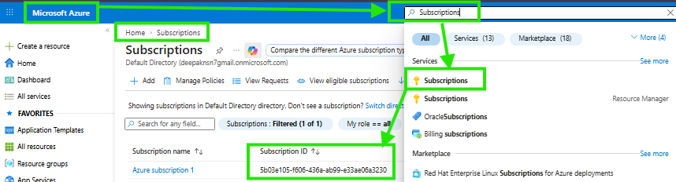
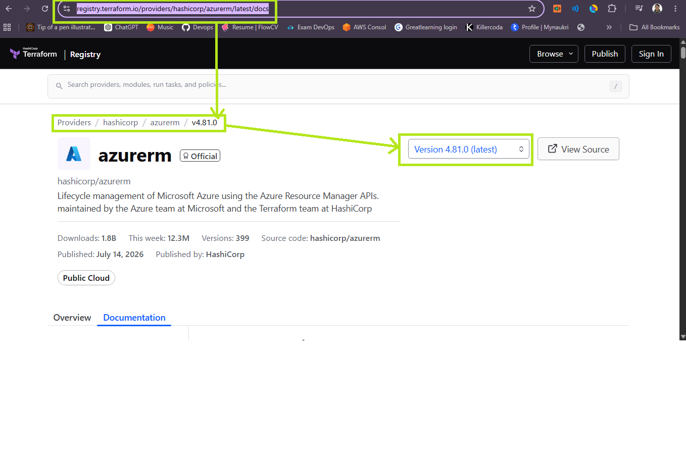
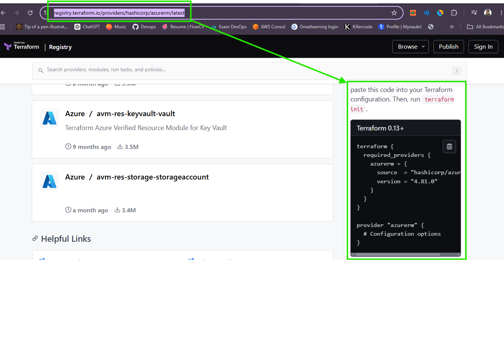

# 🚀 Terraform Project (Azure Resource Group)

---

# 🎯 Project Goal

## 🟢 हिन्दी

इस प्रोजेक्ट का उद्देश्य Terraform का पहला Azure प्रोजेक्ट शुरू करना है। इसमें Installation से लेकर Resource Group Create और Destroy तक की पूरी प्रक्रिया सीखेंगे।

## 🔵 English

This project helps beginners learn Terraform from installation to creating and destroying an Azure Resource Group.

---

# ✅ Prerequisites

## 🟢 हिन्दी

शुरू करने से पहले यह सुनिश्चित करें:

- Terraform Install
- Git Install
- Azure CLI Install
- Visual Studio Code Install
- HashiCorp Terraform Extension
- Azure Subscription
Refer chapter 2
## 🔵 English

Before starting, install:

- Terraform
- Git
- Azure CLI
- VS Code
- HashiCorp Terraform Extension
- Azure Subscription
Refer chapter 2

---

# 🚀 Open Project

## 🟢 हिन्दी

फ़ोल्डर बनाइए और VS Code में खोलिए।

## 🔵 English

Create a folder and open it in VS Code.

```powershell
mkdir Terraform-First-Project
cd Terraform-First-Project
code .
```

---

# 🔐 Azure Login

## 🟢 हिन्दी

यदि Browser Login में समस्या हो तो Device Code Login उपयोग करें।

## 🔵 English

Use Device Code authentication if browser login loops. will show URL and Input Code 

```bash
az login --use-device-code
```

Verify:

```bash
az account show

Command Output Example to see logined account
```
{
  "environmentName": "AzureCloud",
  "homeTenantId": "e9260173-8b41-459c-8cca-cc8424530cf0",
  "id": "a2d0788b-89e9-49c6-8c6a-5f152ef8d304",
  "isDefault": true,
  "managedByTenants": [],
  "name": "Azure subscription 1",
  "state": "Enabled",
  "tenantDefaultDomain": "kishanmishra508gmail494.onmicrosoft.com",
  "tenantDisplayName": "Default Directory",
  "tenantId": "e9260173-8b41-459c-8cca-cc8424530cf0",
  "user": {
    "name": "pradipgavhankar1@b18g2.online",
    "type": "user"
  }
}
```
```
az --version
```
Command Output Example to see logined account
```
azure-cli                         2.87.0

core                              2.87.0
telemetry                          1.1.0

Dependencies:
msal                              1.36.0
azure-mgmt-resource               24.0.0

Python location 'C:\Program Files\Microsoft SDKs\Azure\CLI2\python.exe'
Config directory 'C:\Users\Pradip\.azure'
Extensions directory 'C:\Users\Pradip\.azure\cliextensions'

Python (Windows) 3.13.13 (tags/v3.13.13:01104ce, Apr  7 2026, 19:25:48) [MSC v.1944 64 bit (AMD64)]

Legal docs and information: aka.ms/AzureCliLegal
```
```
terraform --version
```
Command Output Example to see logined account and terraform Installed in Device
```
Terraform v1.14.8
on windows_amd64
+ provider registry.terraform.io/hashicorp/azurerm v4.1.0

Your version of Terraform is out of date! The latest version
is 1.15.8. You can update by downloading from https://developer.hashicorp.com/terraform/install
```

## First Step Login to Azure portal and get Subscription ID for practice Purpose from below Snap and Method



---

# 🆔 Azure Subscription ID कैसे ढूंढें?

## 🟢 पहले हिन्दी में आसान समझ

Azure में प्रत्येक Subscription की एक **Unique पहचान (ID)** होती है, जिसे **Subscription ID** कहते हैं।

Terraform जब Azure में कोई Resource (Resource Group, Virtual Machine, Storage Account आदि) बनाता है, तब उसे यह पता होना चाहिए कि किस Azure Subscription में Resource बनाना है।

इसीलिए कई बार `provider` block में या Azure CLI के माध्यम से Subscription ID का उपयोग किया जाता है।

> 📌 बिना सही Subscription ID के Terraform सही Azure Subscription में Resources नहीं बना पाएगा।

---

## 🔵 English Explanation

Every Azure Subscription has a unique identifier called the **Subscription ID**.

Terraform uses this ID to determine **which Azure Subscription** should be used for deploying infrastructure.

When working with multiple subscriptions (Development, Testing, Production), selecting the correct Subscription ID is very important.

---

## 🖥️ Method 1 – Azure Portal (Recommended for Beginners)

### Step 1

Login to Azure Portal

```
https://portal.azure.com
```

---

### Step 2

Search for

```
Subscription
```

from the top search bar.

---

### Step 3

Click on

```
Subscriptions
```

---

### Step 4

Open your Subscription.

Example

```
Azure subscription 1
```

---

### Step 5

Copy the

```
Subscription ID
```

Example

```
5b03e105-f606-436a-ab99-e33ae06a3230
```

---

## 📸 Azure Portal Screenshot

> नीचे दिया गया Screenshot Azure Portal में Subscription ID खोजने का तरीका दिखाता है।

## 📸 Subscription_ID Screenshot


---

## 💻 Method 2 – Azure CLI (Recommended for DevOps Engineers)

### Display Current Subscription

```bash
az account show
```

Expected Output

```json
{
  "id": "5b03e105-f606-436a-ab99-e33ae06a3230",
  "name": "Azure subscription 1"
}
```

---

### Show Only Subscription ID

```bash
az account show --query id --output tsv
```

Example Output

```
5b03e105-f606-436a-ab99-e33ae06a3230
```

---

### List All Available Subscriptions

```bash
az account list --output table
```

Example Output

```
Name                   CloudName     SubscriptionId                        State
-------------------    ----------    -----------------------------------   -------
Azure subscription 1   AzureCloud    5b03e105-f606-436a-ab99-e33ae06a3230 Enabled
```

---

### Check Current Active Subscription

```bash
az account show --output table
```

---

### Change Active Subscription

```bash
az account set --subscription "Azure subscription 1"
```

or

```bash
az account set --subscription "5b03e105-f606-436a-ab99-e33ae06a3230"
```

---

## 🧱 Using Subscription ID in Terraform

```hcl
provider "azurerm" {

  subscription_id = "5b03e105-f606-436a-ab99-e33ae06a3230"# for learning, in production "var.subscription_id"

  features {}
}
```

---

## 🚀 Real Output Example

```text
Terraform will perform the following actions:

+ azurerm_resource_group.demo will be created

Plan: 1 to add, 0 to change, 0 to destroy.
```

---

# ✅ Good Practice (Production Mindset)

✔ Verify the active subscription before running Terraform.

✔ Use Azure CLI to confirm the current subscription.

✔ Use separate subscriptions for Development, Testing, and Production.

✔ Store Subscription ID in variables or environment variables whenever possible.

✔ Double-check the subscription before executing `terraform apply`.

---

# ❌ Bad Practice (Danger Zone)

❌ Deploying resources without checking the active subscription.

❌ Creating Production resources in a Development subscription.

❌ Hardcoding sensitive values throughout multiple files.

❌ Running Terraform commands without verifying the Azure account.

---

# 😂 DevOps Comedy

Developer:

"Terraform, Resource Group बना दो!"

Terraform:

"किस Subscription में? 😅"

Developer:

"अरे... वही... Azure वाला..."

Terraform:

"पहले Subscription ID बता भाई, मैं ज्योतिषी नहीं हूँ! 😂"

---

# 🎯 Interview Question

**Q. What is an Azure Subscription ID and why is it required in Terraform?**

### Answer

Azure Subscription ID is a unique identifier assigned to every Azure Subscription.

Terraform uses this ID to identify the target Azure Subscription where infrastructure resources should be created.

In enterprise environments, multiple subscriptions are commonly used for Development, Testing, and Production, making the correct Subscription ID essential.

---
```text create .tf files
Terraform-First-Project/
│── provider.tf
│── main.tf
│── variables.tf
│── terraform.tfvars
│── outputs.tf
│── .gitignore
│── README.md
```
```
https://registry.terraform.io/providers/hashicorp/azurerm/latest/docs
```



```
https://registry.terraform.io/providers/hashicorp/azurerm/latest
```



---

# 📄 provider.tf

```hcl
terraform {

  # आवश्यक Azure Provider
  required_providers {
    azurerm = {
      source  = "hashicorp/azurerm"
      version = "~>4.1"
    }
  }
}

# Azure Provider Configuration
provider "azurerm" {

  # Azure Subscription ID
  subscription_id = var.subscription_id # initially you can hardcode for learning,but in production use this kind of ID

  # Mandatory block
  features {}
}
```
### First Command to Run in VS code and ensure this command to be RUN where provider.tf and other .tf files available. if any error occured then probably missed any of above steps, as per Erro debugging is needed with calm and cool mind. so dont worry.
---
Terraform init
---
### It will initialise backend and you can see Output as below in Green Color font
---
Initializing the backend...
Initializing provider plugins...
- Reusing previous version of hashicorp/azurerm from the dependency lock file
- Using previously-installed hashicorp/azurerm v4.1.0

Terraform has been successfully initialized!

You may now begin working with Terraform. Try running "terraform plan" to see
any changes that are required for your infrastructure. All Terraform commands
should now work.

If you ever set or change modules or backend configuration for Terraform,
rerun this command to reinitialize your working directory. If you forget, other
commands will detect it and remind you to do so if necessary.

---

---

# 🎨 Terraform fmt (Code Formatter) 

## 🟢 पहले हिन्दी में आसान समझ

`terraform fmt` Terraform की **Code Formatting Command** है।

यह आपके `.tf` files को Terraform के Official Standard Format में व्यवस्थित (Format) करती है।

अगर आपने code में कहीं extra spaces, गलत indentation या inconsistent formatting लिखी है, तो `terraform fmt` उसे अपने आप ठीक कर देता है।

यह केवल **Formatting बदलता है**, आपके Infrastructure या Logic में कोई बदलाव नहीं करता।

> 📌 सरल शब्दों में: जैसे MS Word में **Format Document** होता है, वैसे ही Terraform में `terraform fmt` है।

---

## 🔵 English Explanation

`terraform fmt` automatically formats Terraform configuration files according to HashiCorp's official style guide.

It improves code readability and ensures consistent formatting across the entire project.

This command **does not modify infrastructure or logic**. It only changes the appearance of the code.

---

## 🧱 Syntax

```bash
terraform fmt
```

---

## 🧱 Format All Terraform Files

```bash
terraform fmt -recursive
```

This command formats all `.tf` files in the current directory and all subdirectories.

---

## 🧱 Before Formatting

```hcl
resource "azurerm_resource_group" "rg"{
name="rg-demo"
location="Central India"
}
```

---

## 🧱 After Running `terraform fmt`

```hcl
resource "azurerm_resource_group" "rg" {
  name     = "rg-demo"
  location = "Central India"
}
```

Notice that:

- Proper indentation is applied.
- Spaces are added around `=`.
- Braces are aligned correctly.
- Code becomes easier to read.

---

## 🚀 Real Output Example

Command:

```bash
terraform fmt
```

Output (when formatting is required):

```text
main.tf
provider.tf
variables.tf
```

This means these files were reformatted successfully.

If nothing is displayed:

```text
(No Output)
```

It means your Terraform code is already properly formatted.

---

## 🧠 When Should You Use `terraform fmt`?

Run this command:

- After writing new Terraform code.
- Before `terraform validate`.
- Before `terraform plan`.
- Before committing code to Git.
- Before creating a Pull Request (PR).

Many companies automatically run `terraform fmt` in their CI/CD pipelines.

---

# ✅ Good Practice (Production Mindset)

✔ Run `terraform fmt` before every Git commit.

✔ Use `terraform fmt -recursive` for large projects.

✔ Keep all Terraform files consistently formatted.

✔ Combine it with:

```bash
terraform init
terraform fmt
terraform validate
terraform plan
```

before deployment.

---

# ❌ Bad Practice (Danger Zone)

❌ Ignoring code formatting.

❌ Mixing tabs and spaces.

❌ Different formatting styles in the same project.

❌ Directly pushing unformatted Terraform code to GitHub.

---

# 😂 DevOps Comedy

Developer:

"Code तो चल रहा है, formatting की क्या जरूरत?"

Terraform:

"चल तो रहा है... लेकिन पढ़ कौन पाएगा? 😄"

---

# 🎯 Interview Question

### Q. What is the purpose of `terraform fmt`?

### Answer

`terraform fmt` automatically formats Terraform configuration files according to HashiCorp's official style guide. It improves readability, maintains consistency across the project, and is considered a best practice before validation, planning, or committing code to version control.

✅ terraform init → initialise backend and plugin of provider
🎨 terraform fmt → Code formatting
✅ terraform validate → Syntax validation
📋 terraform plan → Preview changes
🚀 terraform apply → Deploy infrastructure
---

# 📁 Project Structure


---
# 📄 main.tf

```hcl
resource "azurerm_resource_group" "Resource-PG" { # azurerm_resouce_group label 1 and Resource-PG is the block name, an it is the lable 2
  name     = "rg-demo" # rg-demo is the resource name of azure portal
  location = "Central India"
}
```


# 📄 variables.tf

```hcl
variable "subscription_id" {
  description = "Azure Subscription ID"
  type        = string
}

variable "resource_group_name" {
  description = "Resource Group Name"
  type        = string
}

variable "location" {
  description = "Azure Region"
  type        = string
}
```

---

# 📄 terraform.tfvars

```hcl
subscription_id    = "YOUR-AZURE SUBSCRIPTION-ID"
resource_group_name = "rg-devops-demo"
location            = "Central India"
```

---

# 📄 main.tf

```hcl
resource "azurerm_resource_group" "rg" {

  # Resource Group का नाम
  name = var.resource_group_name

  # Azure Region
  location = var.location
}
```

---

# 🚀 Commands

```bash
terraform init
terraform fmt
terraform validate
terraform plan
terraform apply
terraform destroy
```

---

# 🚀 Expected Output

## terraform plan

```text
Plan: 1 to add, 0 to change, 0 to destroy.
```

## terraform apply

```text
Apply complete!
Resources: 1 added, 0 changed, 0 destroyed.
```

## terraform destroy

```text
Destroy complete!
Resources: 1 destroyed.
```

---

# ❗ Common Errors

## Error

```text
Terraform has no command named "Plan"
```

Reason:

Commands lowercase होते हैं।

Correct:

```bash
terraform plan
```

---

## Error

```text
subscription_id is a required provider property
```

Reason:

Provider configuration अधूरी है।

Solution:

Subscription ID सही दें या Variable उपयोग करें।

---

# ✅ Good Practice

- Always lock provider version.
- Variables का उपयोग करें।
- `terraform fmt` चलाएँ।
- `terraform validate` चलाएँ।
- Production में हमेशा `terraform plan` देखें।
- `.gitignore` में `terraform.tfstate` जोड़ें।
- Remote Backend बाद में configure करें।

---

# ❌ Bad Practice

- Hardcoded Subscription ID
- State File GitHub पर Push करना
- Direct Production Apply
- Azure Portal से Manual Changes
- Version Lock न करना

---

# 😂 DevOps Comedy

Developer:

> "Portal में 100 Click कर दिए!"

Terraform:

> "भाई, 10 लाइन Code लिख लेता तो Coffee भी खत्म नहीं होती! 😄"

---

# 🎯 Interview Questions

1. Terraform क्या है?
2. Provider क्या होता है?
3. terraform init क्या करता है?
4. terraform plan क्यों जरूरी है?
5. terraform apply और destroy में अंतर?
6. State File क्या है?
7. Variables क्यों उपयोग करते हैं?

---

# 🚀 Achievement

यदि आपने यह प्रोजेक्ट पूरा कर लिया है तो आपने:

- Terraform Install किया
- Azure CLI Install किया
- Azure Login किया
- Azure Resource Group Create किया
- Resource Destroy किया
- Terraform Workflow समझ लिया

# 🔄 Terraform Refresh

---

# 🟢 पहले हिन्दी में आसान समझ

Terraform अपनी **State File (`terraform.tfstate`)** में infrastructure की जानकारी रखता है।

लेकिन कई बार Azure Portal, Azure CLI या किसी दूसरे engineer द्वारा infrastructure manually बदल दिया जाता है।

ऐसी स्थिति में **Terraform State** और **Actual Azure Infrastructure** में अंतर आ जाता है।

इस अंतर को पहचानने के लिए Terraform **Refresh** करता है।

**Refresh का मतलब:**

> Azure से latest information लेकर Terraform State को actual infrastructure के अनुसार update करना।

---

# 🔵 English Explanation

Terraform Refresh synchronizes the Terraform state with the real infrastructure.

It queries the cloud provider (Azure, AWS, GCP, etc.) and updates the local or remote state file to match the current state of the infrastructure.

Refresh **does not create, modify, or delete resources.**

It only updates Terraform's knowledge of the infrastructure.

---

# 🧠 Why is Refresh Needed?

Suppose Terraform State says:

```
VM Size = Standard_B2s
```

But another engineer manually changed it from Azure Portal:

```
VM Size = Standard_D2s_v5
```

Now:

```
Terraform State ❌
        ≠
Azure Infrastructure
```

Refresh reads Azure again and updates the state.

---

# 🏗 Real World Example

### Initial State

```
Azure Portal

Resource Group
│
└── VM
      Name = Dev-VM
      Size = B2s
```

Terraform State

```
VM Size = B2s
```

---

### Someone Changes Azure Portal

```
Azure Portal

Resource Group
│
└── VM
      Name = Dev-VM
      Size = D2s_v5
```

Terraform State still contains

```
VM Size = B2s
```

Now state becomes outdated.

---

### After Refresh

Terraform reads Azure again.

Updated State:

```
VM Size = D2s_v5
```

Now State and Azure are synchronized.

---

# 🚀 What Happens Internally?

```
Terraform State
        │
        ▼
Azure Provider
        │
        ▼
Azure REST API
        │
        ▼
Reads Actual Resources
        │
        ▼
Updates State File
```

---

# 📦 When is Refresh Used?

Refresh is useful when:

✅ Resources were modified manually from Azure Portal

✅ Azure CLI changed infrastructure

✅ Another Terraform project modified resources

✅ State file is outdated

✅ Before planning infrastructure changes

---

# ⚙ Traditional Refresh Command

Older Terraform versions:

```bash
terraform refresh
```

This updated only the Terraform state.

> Note:
> This command is deprecated in modern Terraform versions.

---

# ✅ Modern Recommended Way

Run:

```bash
terraform plan
```

or

```bash
terraform apply
```

Both commands automatically refresh the state before calculating changes.

---

# 🧱 Example

Current Azure Portal

```
Storage Account
SKU = Standard_LRS
```

Terraform State

```
SKU = Standard_GRS
```

Running:

```bash
terraform plan
```

Terraform first refreshes the state from Azure and then compares it with your configuration.

---

# 🚀 Expected Output

```bash
terraform plan
```

Example:

```
Refreshing Terraform state...

Reading...

Read complete...

Plan: 0 to add, 1 to change, 0 to destroy.
```

---

# 🎯 Benefits of Refresh

✔ Keeps Terraform State accurate

✔ Detects configuration drift

✔ Synchronizes with Azure

✔ Prevents incorrect execution plans

✔ Improves infrastructure reliability

✔ Helps identify manual changes

---

# ⚠ Refresh Does NOT

❌ Create resources

❌ Delete resources

❌ Modify Azure infrastructure

❌ Update Terraform code (.tf files)

It only updates the Terraform State.

---

# 🌍 Refresh vs Plan

| Refresh | Plan |
|----------|------|
| Reads actual infrastructure | Reads infrastructure + compares with code |
| Updates Terraform State | Shows planned changes |
| Does not create resources | Does not create resources |
| Deprecated as standalone command | Recommended command |

---

# 🌍 Refresh vs Apply

| Refresh | Apply |
|----------|--------|
| Updates State | Updates Infrastructure |
| No infrastructure changes | Creates/Updates/Deletes resources |
| Read operation | Write operation |

---

# 🏢 Production Reality

In enterprise environments:

❌ Engineers rarely use `terraform refresh` directly.

Instead they use:

```bash
terraform plan
```

because it automatically refreshes the state before generating the execution plan.

---

# ✅ Good Practice

✔ Always run `terraform plan` before `terraform apply`

✔ Avoid manual changes in Azure Portal

✔ Store state in a remote backend

✔ Review drift before applying changes

✔ Keep one source of truth for infrastructure

---

# ❌ Bad Practice

❌ Editing Azure resources manually

❌ Ignoring drift between state and infrastructure

❌ Depending on outdated state files

❌ Running apply without reviewing the plan

---

# 😂 DevOps Comedy

Azure:

> "Someone changed the VM manually!"

Terraform State:

> "Mujhe to abhi bhi purani information yaad hai."

Terraform Plan:

> "Chalo pehle Azure se latest update lekar aata hoon!" 😄

---

# 🎯 Interview Questions

### Q1. What is Terraform Refresh?

**Answer:**

Terraform Refresh synchronizes the Terraform state file with the actual infrastructure by querying the cloud provider APIs. It updates the state but does not modify infrastructure.

---

### Q2. Is `terraform refresh` still recommended?

**Answer:**

No. The standalone `terraform refresh` command is deprecated. Modern Terraform automatically refreshes the state during `terraform plan` and `terraform apply`.

---

### Q3. Does Refresh modify Azure resources?

**Answer:**

No. It only updates the Terraform state file based on the current infrastructure.

---

# 📌 Quick Summary

- Refresh synchronizes State with actual infrastructure.
- It detects infrastructure drift.
- It never creates or deletes resources.
- Modern Terraform performs refresh automatically during `plan` and `apply`.
- Running `terraform plan` is the recommended approach.
---

# 📌 Author

**Pradip – DevOps & Cloud Learning Journey**
